# Comprehensive Domain Analysis & Ubiquitous Language (`DOMAIN_ANALYSIS.md`)

## 1. Executive Summary & Operational Scope

**Sthanori** is a multi-tenant property management and rental billing platform designed to operate seamlessly across three real estate operational modes:

1. **Multi-Property & Multi-Unit Residential**: Traditional apartment buildings, duplexes, and single-family rental complexes where individual units/apartments are leased to residents with sub-meters, flat fees, or proportional utility allocations.
2. **Shared Housing / Co-living**: Houses or large apartments where individual private bedrooms are leased to occupants/roommates who share common utilities (electricity, high-speed WiFi, water, cleaning) split equally or by custom allocation ratios.
3. **Commercial Real Estate**: Office buildings, medical suites, and retail storefronts leased to commercial business entities with Ratio Utility Billing System (RUBS) calculations based on square footage, Common Area Maintenance (CAM) reconciliations, value-added taxes (VAT/sales tax), and commercial lease covenants.

---

## 2. Ubiquitous Language (Domain Dictionary)

To eliminate ambiguity across business stakeholders and engineering teams, the following terms constitute the strict Ubiquitous Language of the domain.

### 2.1 Tenancy & Identity Disambiguation (Critical Invariant)

> [!IMPORTANT]
> **SaaS Tenancy vs. Real Estate Tenancy**:
> - **`TenantId` (SaaS Workspace)**: The software-level isolation identifier representing the Landlord's account or Property Management Company subscribing to the Sthanori platform. Enforced at the database Row-Level Security (RLS) layer.
> - **`Renter` / `LeaseParty` (Real Estate)**: The physical individual or legal business entity leasing a physical property or space. To prevent catastrophic naming collisions, **the word "Tenant" is never used in domain entities to refer to a renting customer**.

| Domain Term | Definition | Context / Role |
| :--- | :--- | :--- |
| **Landlord** / **PropertyManager** | The legal property owner or managing agency operating the SaaS workspace (`tenantId`). | Operator / Creditor |
| **Property Owner** | External investor or property deed holder who contracts a Property Manager to oversee assets. | Asset Owner / Payee |
| **Owner Disbursement** | Periodic payout transfer from Property Manager to Property Owner (Gross Rent - Management Fees - Repairs). | Financial Outflow |
| **Management Fee** | Percentage (e.g. 8%) or flat commission deducted by Property Manager for management services. | Operating Revenue |
| **Renter** (Base Entity) | The generic counter-party entering into a lease agreement. | Debtor / Customer |
| **Resident** | A physical human being leasing a residential apartment or house. | Residential Mode |
| **Occupant** / **Roommate** | An individual leasing an individual room within a shared residential co-living space. | Co-living Mode |
| **Commercial Client** | A registered business entity leasing office, retail, or industrial space. | Commercial Mode |
| **Property** | A physical real estate asset, parcel, or building located at a validated geographic address. | Real Estate Asset |
| **Rentable Space** | A rentable demarcation within a property (an entire apartment, a specific room, or a commercial suite). | Unit of Inventory |
| **Lease Agreement** | The binding contractual agreement between Landlord and Renter(s) defining terms, rent, and rules. | Contractual Aggregate |
| **Rent Escalation** | Scheduled contractual rent adjustments over multi-year leases (stepped or CPI-indexed). | Price Schedule |
| **Renewal Proposal** | Formal offer extended to renter prior to lease expiry proposing new terms or rate revisions. | Lifecycle Offer |
| **Security Deposit** | Funds collected at lease inception held in escrow to guarantee against property damage or default. | Escrow Liability |
| **Escrow Account** | Dedicated bank account segregating tenant deposit liabilities from operational cash. | Fiduciary Ledger |
| **Statutory Interest** | Jurisdictional interest accrued on held deposits payable or creditable to the renter. | Accrued Liability |
| **Move-Out Settlement** | Final reconciliation statement balancing deposits against unpaid rent, utilities, and repair damages. | Closing Statement |
| **Utility** | An ongoing service (electricity, water, gas, internet, trash) consumed in a space. | Service Resource |
| **Sub-Meter** | A physical or virtual measurement device dedicated to a single rentable space tracking usage units. | Metering Device |
| **Physical Unit of Measure**| Physical metric: `KWH` (electric), `GALLONS` / `CUBIC_METERS` / `CCF` (water), `THERMS` (gas), `MBPS` (internet). | Standard Measurement |
| **Meter Submission** | Self-service meter reading uploaded by a renter with mandatory photographic dial evidence. | Ingestion Record |
| **Master Bill** | A consolidated utility invoice issued by a city or utility provider for an entire property. | Aggregated Cost |
| **CAM (Common Area Maint.)**| House utility & maintenance expenses for shared spaces (hallway lighting, lobby HVAC, elevators). | Operational Cost |
| **RUBS (Ratio Utility Billing)**| Mathematical formula distributing a master bill across units based on square footage or occupant count. | Allocation Algorithm |
| **Spike Anomaly Alert** | Flag triggered when a meter reading deviates significantly from historical rolling averages (>200%). | Verification Gate |
| **Maintenance Work Order** | Operational ticket tracking repair requests, technician dispatch, parts costs, and labor. | Maintenance Context |
| **Tenant Chargeback** | Maintenance expense billed directly to renter's invoice due to tenant negligence or damages. | Invoiced Cost |
| **Ancillary Service / Add-on**| Recurring non-rent lease service: Parking space, Pet rent, Storage locker, Valet trash, EV charging. | Ancillary Revenue |
| **Incidental Fee** | One-time administrative or operational charge: Lockout fee, key fob replacement, returned check fee. | One-time Fee |
| **Concession** | Promotional discount: Upfront (e.g. 1st month free) or Amortized across lease with clawback terms. | Rent Concession |
| **Early-Bird Discount** | Small incentive discount (e.g. $25) applied if rent is tendered before a designated early date. | Payment Incentive |
| **Delinquency Notice** | Statutory legal notice ("Notice to Pay or Quit") demanding payment of arrears within statutory days. | Legal Workflow |
| **Repayment Plan** | Binding installment agreement allowing delinquent renters to pay arrears over time alongside rent. | Debt Restructuring |
| **Legal Hold** | Account flag blocking partial payments during active legal/eviction proceedings. | Enforcement Gate |
| **Rental Invoice** | Periodic billing statement detailing base rent, itemized utilities, recurring fees, and adjustments. | Financial Statement |
| **Split Invoicing** | Splitting a single joint-and-several lease invoice into individualized roommate bills. | Multi-Renter Strategy |
| **Payment Waterfall** | Priority hierarchy governing how partial payments are allocated across invoice line items. | Accounting Protocol |
| **Grace Period** | Allowable window of days between invoice due date and late fee assessment. | Temporal Rule |
| **Proration** | Calculation of fractional rent when tenancy begins or terminates mid-billing cycle. | Financial Adjustment |

---

## 3. Bounded Contexts & Context Map

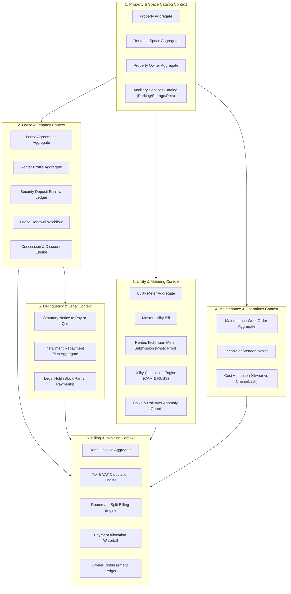

---

## 4. Aggregate Roots & Entity Invariants

### 4.1 `PropertyAggregate`
- **Identity**: `PropertyId`, immutable `tenantId`.
- **Properties**: Name, Address (Street, City, State, PostalCode, Country), `PropertyType` (`RESIDENTIAL_MULTIFAMILY`, `SINGLE_FAMILY`, `CO_LIVING`, `COMMERCIAL`, `MIXED_USE`), `OwnerId` (nullable if self-managed), `ManagementFeeConfig` (percentage or flat).
- **Invariants**:
  - Address must be valid and non-empty.
  - A Property encapsulates zero or more `RentableSpace` entities.
  - Deleting a Property is prohibited if active leases exist.

### 4.2 `PropertyOwnerAggregate`
- **Identity**: `OwnerId`, immutable `tenantId`.
- **Properties**: LegalName, ContactEmail, ContactPhone, TaxId, BankDisbursementDetails, DefaultManagementFeePct (e.g. 8.00%).
- **Invariants**:
  - Bank routing and account details must be encrypted at rest.
  - Owner statements must balance: $\text{Disbursement} = \text{Gross Rent} - \text{Management Fees} - \text{Owner Maintenance Expenses}$.

### 4.3 `RentableSpaceAggregate` (Unit / Room / Suite)
- **Identity**: `SpaceId`, `PropertyId`, immutable `tenantId`.
- **Properties**: SpaceNumber/Label (e.g. "Apt 4B", "Bedroom 2", "Suite 300"), `SpaceType` (`WHOLE_APARTMENT`, `PRIVATE_ROOM`, `COMMERCIAL_SUITE`), FloorAreaSqFt, MaxOccupants, BaseRentAmount, Status (`VACANT`, `OCCUPIED`, `MAINTENANCE`, `RESERVED`), `ParentUnitId` (for co-living rooms grouped in an apartment).
- **Invariants**:
  - Status cannot be set to `VACANT` if an active `LeaseAgreement` covers the current date.
  - Square footage must be greater than zero.

### 4.4 `RenterProfileAggregate`
- **Identity**: `RenterId`, immutable `tenantId`.
- **Properties**: PrimaryName, ContactEmail, ContactPhone, `RenterType` (`RESIDENTIAL_RESIDENT`, `CO_LIVING_OCCUPANT`, `COMMERCIAL_CLIENT`), TaxOrBusinessId (for commercial), EmergencyContacts, CreditBalance, `IsLegalHoldActive` (boolean).
- **Invariants**:
  - Email format must be validated via standard email regex schema.
  - Credit balance represents overpayments and must be automatically applied to future invoices.
  - When `IsLegalHoldActive` is true, partial payments are strictly rejected.

### 4.5 `LeaseAgreementAggregate`
- **Identity**: `LeaseId`, `SpaceId`, immutable `tenantId`.
- **Properties**:
  - Primary Renter and co-signers/roommates list (`RenterId[]` with individual split percentages if configured).
  - Dates: `StartDate`, `EndDate` (nullable if month-to-month), `MoveInDate`, `MoveOutDate`.
  - Financial Terms: BaseRentAmount, Currency, BillingCycleDay (e.g., 1st), PaymentGracePeriodDays.
  - `RentEscalationSchedule`: Scheduled future rent adjustments: `[{ effectiveDate: string, newAmount: number, reason: string }]`.
  - `AncillaryServices`: Attached recurring add-ons (Parking, Pet Rent, Storage, EV Charging, Valet Trash).
  - `ConcessionPlan`: Upfront free months or monthly amortized discounts with early-termination clawback terms.
  - `EarlyBirdIncentive`: Optional discount amount if paid on/before specified day of prior month.
  - Security Deposit: AmountRequired, AmountPaid, Status (`PENDING`, `HELD_IN_ESCROW`, `SETTLED`).
  - Lifecycle Status: `DRAFT`, `PENDING_APPROVAL`, `ACTIVE`, `UNDER_NOTICE`, `EXPIRED`, `MONTH_TO_MONTH`, `TERMINATED`, `CLOSED`.
- **Invariants**:
  - `EndDate` must be strictly after `StartDate`.
  - Base rent must be represented as a positive integer in minor currency units (e.g. cents).
  - Roommate split percentages (if configured) must sum exactly to 100.00%.

### 4.6 `MeterReadingSubmissionAggregate`
- **Identity**: `SubmissionId`, `MeterId`, `SpaceId`, immutable `tenantId`.
- **Properties**:
  - Submitter: `SubmitterRole` (`RENTER` | `LANDLORD` | `TECHNICIAN`), `SubmitterId`.
  - ReadingData: MeterReadingValue, UnitOfMeasure (`KWH`, `GALLONS`, `CUBIC_METERS`, `CCF`, `THERMS`), ReadingDate.
  - Evidence: PhotoProofUrl (mandatory for renter submissions), Timestamp, DeviceMetadata.
  - Verification: Status (`SUBMITTED`, `VERIFIED_BY_LANDLORD`, `FLAGGED_SPIKE`, `DISPUTED`, `REJECTED`, `INVOICED`), VerificationDate, ReviewerNotes.
- **Invariants**:
  - Submissions by renters require a valid photo URL.
  - Readings flagged as `FLAGGED_SPIKE` (>200% rolling average) cannot be invoiced without explicit supervisor verification.

### 4.7 `SecurityDepositEscrowLedger`
- **Identity**: `EscrowLedgerId`, `LeaseId`, immutable `tenantId`.
- **Deposit Breakdown**: Itemized lines by category:
  - `SECURITY_DEPOSIT` (general damage/rent default)
  - `PET_DEPOSIT` (pet damage guarantee)
  - `KEY_ACCESS_DEPOSIT` (fob/key guarantee)
  - `ADVANCE_LAST_MONTH_RENT` (prepaid final month rent)
- **Properties**: EscrowBankAccountId, TotalCollected, AccruedInterestAmount, StatutoryInterestRatePct, Status (`HELD_IN_ESCROW`, `RECONCILING`, `SETTLED`).
- **Move-Out Settlement (`MoveOutSettlementStatement`)**:
  - Itemized deductions: Unpaid Rent, Outstanding Utilities (final sub-meter or escrow holdback), Repair Damages (linked Work Order IDs), Cleaning Fees.
  - Settlement Formula: $\text{NetRefund} = \text{TotalCollected} + \text{AccruedInterest} - \text{TotalDeductions}$.

### 4.8 `MaintenanceWorkOrderAggregate`
- **Identity**: `WorkOrderId`, `SpaceId`, `PropertyId`, immutable `tenantId`.
- **Properties**: Title, Description, Category (`PLUMBING`, `HVAC`, `ELECTRICAL`, `APPLIANCE`, `STRUCTURAL`, `LOCK_SECURITY`), Priority (`LOW`, `MEDIUM`, `HIGH`, `EMERGENCY`), ReportedByRenterId, AssignedVendorId.
- **Financial Attribution**:
  - `CostAttribution`: `LANDLORD_EXPENSE` (owner operating cost) vs. `TENANT_CHARGEBACK` (tenant liability).
  - EstimatedCost, FinalLaborCost, FinalPartsCost, TotalCost, SupportingInvoices/Photos.
  - `InvoicedStatus`: `NOT_INVOICED` | `INVOICED_TO_RENTER` | `DEDUCTED_FROM_OWNER`.
- **Status**: `SUBMITTED` $\to$ `DISPATCHED` $\to$ `IN_PROGRESS` $\to$ `COMPLETED` $\to$ `CLOSED`.

### 4.9 `RepaymentPlanAggregate`
- **Identity**: `RepaymentPlanId`, `LeaseId`, `RenterId`, immutable `tenantId`.
- **Properties**: TotalArrearsDebt, MonthlyInstallmentAmount, TotalInstallments, RemainingInstallments, StartDate, NextInstallmentDueDate, Status (`ACTIVE`, `DEFAULTED`, `SATISFIED`).
- **Invariants**:
  - Monthly installment is appended as an itemized line item to each recurring monthly rental invoice.
  - A missed repayment installment automatically transitions status to `DEFAULTED` and alerts landlord to resume legal action.

### 4.10 `RentalInvoiceAggregate`
- **Identity**: `InvoiceId`, `LeaseId`, immutable `tenantId`.
- **Properties**: InvoiceNumber, IssueDate, DueDate, PeriodStartDate, PeriodEndDate, `RecipientRenterId` (supports roommate split invoices), Status (`DRAFT`, `ISSUED`, `PARTIALLY_PAID`, `PAID`, `OVERDUE`, `VOIDED`).
- **Line Items (`InvoiceLineItem`)**:
  - `Type`: `BASE_RENT`, `UTILITY_ELECTRICITY`, `UTILITY_WATER`, `UTILITY_INTERNET`, `CAM_FEE`, `ANCILLARY_PARKING`, `ANCILLARY_PET`, `ANCILLARY_STORAGE`, `MAINTENANCE_CHARGEBACK`, `REPAYMENT_INSTALLMENT`, `LATE_FEE`, `CONCESSION_DISCOUNT`, `EARLY_BIRD_DISCOUNT`, `TAX_LEVY`, `CUSTOM`.
  - Description, Quantity, UnitPrice, TotalAmount, `TaxRatePct` (e.g. 0% residential, 10% commercial/parking).
- **Payments (`PaymentReceipt`)**:
  - ReceiptId, AmountPaid, PaymentDate, Method (`CASH`, `CHECK`, `BANK_TRANSFER`, `CREDIT_CARD`), ReferenceNumber, AllocatedBreakdown.
- **Invariants**:
  - Total amount equals the sum of line items.
  - Balance Due equals Total Amount minus Sum of allocated Payments.
  - Status automatically transitions to `PAID` when Balance Due reaches 0.

---

## 5. Domain Strategy Patterns (Configurable Algorithms)

In strict alignment with ADR-007, algorithmic variations are isolated behind owned domain strategy interfaces, resolved via application factories and feature flags.

```mermaid
classDiagram
    class IUtilityCalculationStrategy {
        <<interface>>
        +calculate(space, readings, masterBill, camConfig) UtilityCharge
    }
    class SubMeterCalculationStrategy {
        +calculate()
    }
    class EqualSplitCalculationStrategy {
        +calculate()
    }
    class RubsSqftCalculationStrategy {
        +calculate()
    }
    class FlatFeeCalculationStrategy {
        +calculate()
    }

    IUtilityCalculationStrategy <|.. SubMeterCalculationStrategy
    IUtilityCalculationStrategy <|.. EqualSplitCalculationStrategy
    IUtilityCalculationStrategy <|.. RubsSqftCalculationStrategy
    IUtilityCalculationStrategy <|.. FlatFeeCalculationStrategy

    class IRoommateBillingStrategy {
        <<interface>>
        +generateInvoices(lease, period) RentalInvoice[]
    }
    class JointSeveralSplitInvoiceStrategy {
        +generateInvoices()
    }
    class SingleMasterInvoiceStrategy {
        +generateInvoices()
    }
    class IndividualRoomLeaseStrategy {
        +generateInvoices()
    }

    IRoommateBillingStrategy <|.. JointSeveralSplitInvoiceStrategy
    IRoommateBillingStrategy <|.. SingleMasterInvoiceStrategy
    IRoommateBillingStrategy <|.. IndividualRoomLeaseStrategy

    class IFinalUtilitySettlementStrategy {
        <<interface>>
        +calculateFinalSettlement(space, moveOutDate, deposit) UtilitySettlementResult
    }
    class FinalPhysicalMeterReadingStrategy {
        +calculateFinalSettlement()
    }
    class HistoricalDailyAverageStrategy {
        +calculateFinalSettlement()
    }
    class TemporaryEscrowHoldbackStrategy {
        +calculateFinalSettlement()
    }

    IFinalUtilitySettlementStrategy <|.. FinalPhysicalMeterReadingStrategy
    IFinalUtilitySettlementStrategy <|.. HistoricalDailyAverageStrategy
    IFinalUtilitySettlementStrategy <|.. TemporaryEscrowHoldbackStrategy

    class ITaxCalculationStrategy {
        <<interface>>
        +calculateTax(lineItem, renterType) TaxResult
    }
    class StandardTaxCalculationStrategy {
        +calculateTax()
    }
    ITaxCalculationStrategy <|.. StandardTaxCalculationStrategy
```

### 5.1 `IUtilityCalculationStrategy` (with CAM Deduction)
- **`SubMeterCalculationStrategy`**: Charge = $(Reading_{current} - Reading_{previous}) \times RatePerUnit$.
- **`EqualSplitCalculationStrategy`**: Charge = $(MasterBill \times (1 - CamAllowancePct)) / ActiveOccupantCount$.
- **`RubsSqftCalculationStrategy`**: Charge = $(MasterBill \times (1 - CamAllowancePct)) \times (SpaceSqFt / TotalPropertySqFt)$.
- **`FlatFeeCalculationStrategy`**: Fixed recurring amount defined in lease agreement.

### 5.2 `IFinalUtilitySettlementStrategy` (Move-Out Settlement)
- **`FinalPhysicalMeterReadingStrategy`**: Reading taken on move-out day multiplied by active tariff; charged immediately.
- **`HistoricalDailyAverageStrategy`**: Daily average of prior 90 days multiplied by days occupied in final cycle; charged immediately.
- **`TemporaryEscrowHoldbackStrategy`**: Holds an agreed escrow amount (e.g. $150) until the municipal utility bill arrives, then true-up and refund remaining balance.

### 5.3 `IRoommateBillingStrategy`
- **`JointSeveralSplitInvoiceStrategy`**: Generates individualized invoices per roommate based on configured split percentages (e.g. 50/50), while retaining joint legal liability on the underlying lease.
- **`SingleMasterInvoiceStrategy`**: Generates one master invoice for the entire unit; roommates make partial payments toward the shared balance.
- **`IndividualRoomLeaseStrategy`**: Generates an independent invoice for each private bedroom lease, with common utilities split among current active occupants.

### 5.4 `IPaymentAllocationStrategy`
- **`FifoWaterfallAllocationStrategy` (Default)**: Payments clear oldest outstanding invoices first. Within an invoice, funds clear `BASE_RENT` first, followed by `UTILITIES`, then `ANCILLARY_SERVICES`, then `MAINTENANCE_CHARGEBACKS`, then `LATE_FEES`.
- **`ProportionalAllocationStrategy`**: Funds distributed pro-rata across all unpaid line items based on their percentage of the remaining balance.
- **`StrictFullAllocationStrategy`**: Rejects partial allocation; holds funds in unapplied credit until full invoice amount is satisfied.

### 5.5 `ITaxCalculationStrategy`
- Residential leases: Base rent is tax-exempt ($0\%$). Ancillary parking/storage or short-term stays taxed according to jurisdiction.
- Commercial leases: Rent, CAM, and parking taxed at configured VAT/Sales Tax rate (e.g. $10\%$ or $19\%$).

---

## 6. State Machine Specifications

### 6.1 Lease Agreement State Machine

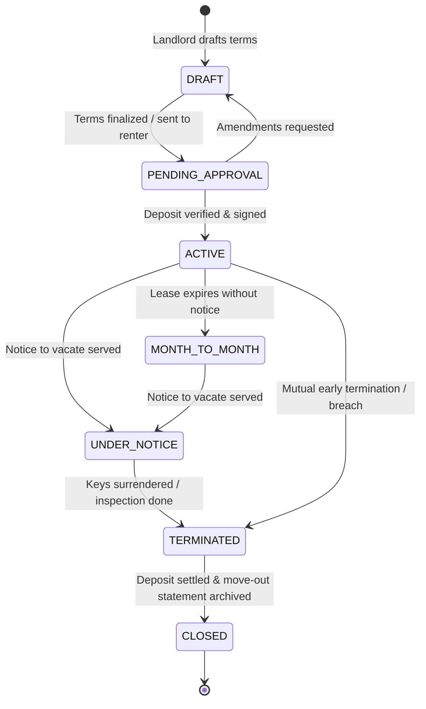

### 6.2 Renter Meter Photo Submission State Machine

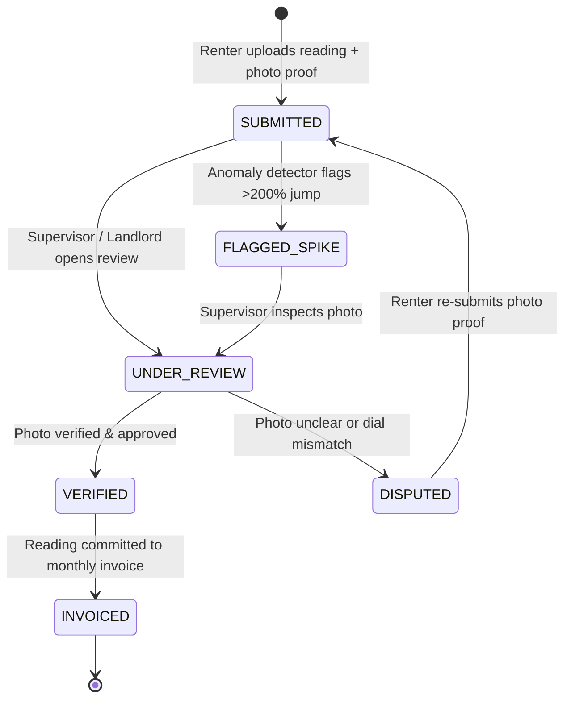

### 6.3 Delinquency Repayment Plan State Machine

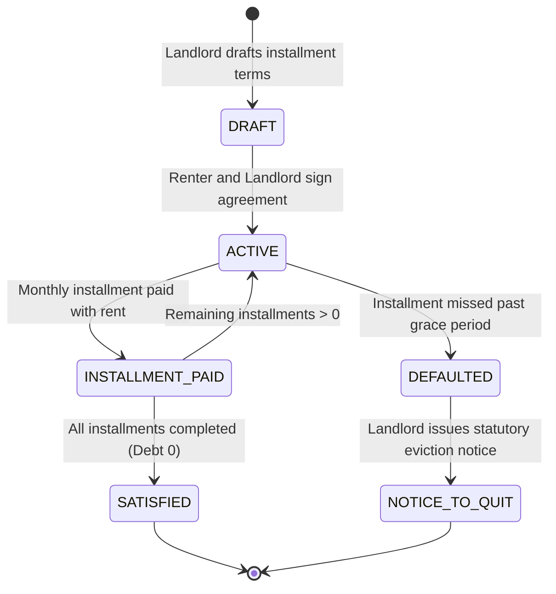

### 6.4 Maintenance Work Order State Machine

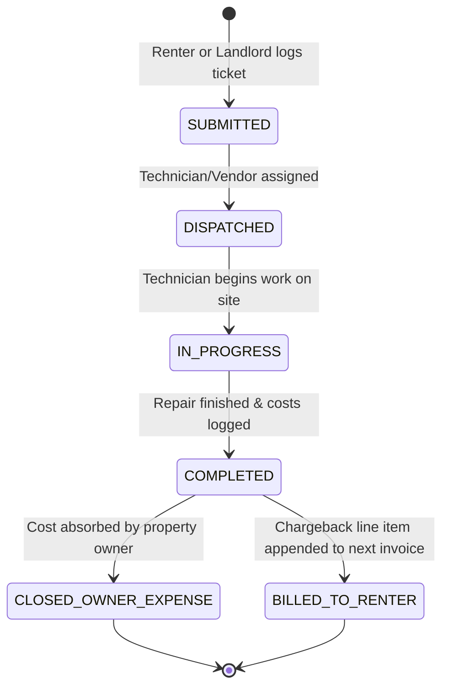

---

## 7. Security Deposit Escrow & Move-Out Settlement

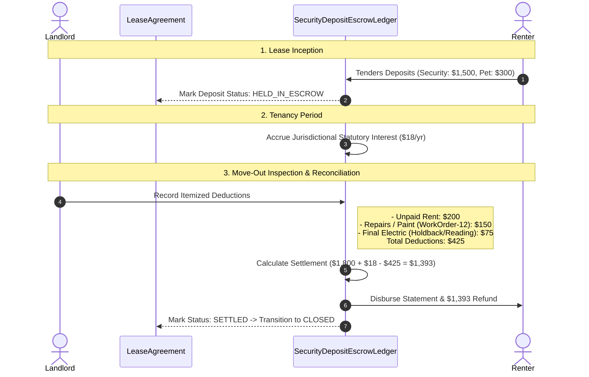

---

## 8. Utility Tariff Engine & Multi-Utility Modeling

### 8.1 Multi-Utility Classification & Physical Metrics

Utility billing extends beyond simple single-rate sub-metering. Sthanori models multi-resource utility physics, accounting for divergent measurement units, fixed connection overheads, and derived utility volumes:

| Utility Type | Native Unit of Measure | Pricing Models Supported | Physical Invariants & Calculation Nuance |
| :--- | :--- | :--- | :--- |
| **Electricity** | `KWH`, `KW_PEAK_DEMAND` | Single Flat, Inclining Block (IBT), Two-Part, Time-of-Use (TOU) | Sub-meter dial reads cumulative kWh. Commercial meters may also track peak kW demand. |
| **Clean Water** | `GALLONS`, `CUBIC_METERS`, `CCF` ($1\text{ CCF} = 748\text{ gal}$) | Tiered Block, Two-Part (Base meter fee + volumetric) | Flow meters measure cumulative volume. Must detect reverse flow / backflow anomalies. |
| **Sewer / Wastewater** | `VOLUMETRIC_EQUIVALENT` | Percentage of Water, Winter Quarter Average (WQA), Flat | Wastewater outflow is unmetered; derived mathematically from inbound water volume. |
| **Natural Gas / Heating** | `THERMS`, `CUBIC_METERS`, `BTU` | Single Rate, Seasonal Winter Multiplier | Volumetric gas is multiplied by the utility's thermal conversion factor to obtain therms. |
| **Central HVAC / Chilled Water**| `TON_HOURS`, `BTU` | BTU sub-metering, RUBS by SqFt | Common in commercial suites and modern high-rises; measures delta-T and water flow. |
| **High-Speed Internet / WiFi** | `BANDWIDTH_TIER_MBPS`, `DEDICATED_CIRCUIT`| Flat Monthly Tier, Pooled Bandwidth Surcharge | Bulk property contract (wholesale) allocated to renters at fixed retail tiers (e.g. 500 Mbps, 1 Gbps). |
| **Trash & Recycling** | `CONTAINER_VOLUME_GALLONS`, `PICKUP_FREQUENCY` | Equal Split per Unit, Flat Fee per Bin, Overage Surcharge | Base municipal container allocation plus tenant chargebacks for bulky item disposal. |
| **EV Charging Stations** | `KWH_CONSUMED`, `IDLE_DWELL_MINUTES` | Multi-Factor: Energy + Session Fee + Idle Penalty | Tracks energy delivered plus idle dwell penalties ($/min) after a 30-minute post-charge grace window. |

---

### 8.2 `UtilityTariffAggregate`

- **Identity**: `TariffId`, immutable `tenantId`.
- **Properties**:
  - `UtilityType`: `ELECTRICITY`, `WATER`, `SEWER`, `GAS`, `HVAC_COOLING`, `INTERNET`, `TRASH`, `EV_CHARGING`.
  - `TariffStructureType`: `SINGLE_RATE`, `INCLINING_BLOCK_TIERED`, `TWO_PART_FIXED_VOLUMETRIC`, `TIME_OF_USE`.
  - `Currency`: ISO 4217 currency code (e.g. `USD`, `EUR`, `CAD`).
  - `EffectiveDateRange`: `StartDate`, `EndDate` (for time-versioned tariff rate hikes).
  - `FixedCustomerCharge`: Fixed monthly base fee in minor currency units (e.g. $18.50/mo connection readiness).
  - `RateTiers`: Array of tier boundaries and unit rates:
    `[{ tierNumber: 1, minUnits: 0, maxUnits: 300, ratePerUnit: 1200 }, { tierNumber: 2, minUnits: 301, maxUnits: 600, ratePerUnit: 1800 }, { tierNumber: 3, minUnits: 601, maxUnits: null, ratePerUnit: 2800 }]`
  - `TimeOfUseWindows`: Peak, Off-Peak, and Shoulder rate schedules:
    - *Off-Peak* (23:00 - 07:00): Base rate ($0.09/kWh).
    - *Mid-Peak / Shoulder* (07:00 - 14:00, 20:00 - 23:00): Medium rate ($0.16/kWh).
    - *On-Peak* (14:00 - 20:00): High rate ($0.34/kWh).
  - `SeasonalMultiplier`: Seasonal adjustment factor (e.g. 1.25x during summer peak months June–September).
- **Invariants**:
  - Tier boundaries must be continuous without gaps or overlaps (Tier $N$ `minUnits` must equal Tier $N-1$ `maxUnits` $+ 1$).
  - Rates must be non-negative integers in minor currency units.

---

### 8.3 Specialized Utility Calculation Strategies

```mermaid
classDiagram
    class ITariffEvaluationStrategy {
        <<interface>>
        +evaluateCost(unitsConsumed, tariff, context) MonetaryAmount
    }
    class SingleRateTariffStrategy {
        +evaluateCost()
    }
    class IncliningBlockTariffStrategy {
        +evaluateCost()
    }
    class TwoPartTariffStrategy {
        +evaluateCost()
    }
    class TimeOfUseTariffStrategy {
        +evaluateCost()
    }

    ITariffEvaluationStrategy <|.. SingleRateTariffStrategy
    ITariffEvaluationStrategy <|.. IncliningBlockTariffStrategy
    ITariffEvaluationStrategy <|.. TwoPartTariffStrategy
    ITariffEvaluationStrategy <|.. TimeOfUseTariffStrategy

    class ISewerCalculationStrategy {
        <<interface>>
        +calculateSewerCharge(waterVolume, winterAverage, tariff) MonetaryAmount
    }
    class WaterPercentageSewerStrategy {
        +calculateSewerCharge()
    }
    class WinterQuarterAverageSewerStrategy {
        +calculateSewerCharge()
    }
    class FlatSewerFeeStrategy {
        +calculateSewerCharge()
    }

    ISewerCalculationStrategy <|.. WaterPercentageSewerStrategy
    ISewerCalculationStrategy <|.. WinterQuarterAverageSewerStrategy
    ISewerCalculationStrategy <|.. FlatSewerFeeStrategy

    class IEvChargingTariffStrategy {
        <<interface>>
        +calculateSessionCost(kwhConsumed, sessionMinutes, idleMinutes, tariff) EvChargeBreakdown
    }
    class MultiFactorEvChargingStrategy {
        +calculateSessionCost()
    }
    IEvChargingTariffStrategy <|.. MultiFactorEvChargingStrategy
```

#### 8.3.1 Sewer / Wastewater Calculation Algorithms (`ISewerCalculationStrategy`)
1. **`WaterPercentageSewerStrategy`**:
   - Assumes a fixed percentage of clean metered water enters the sewer system (e.g., 90% or 100%).
   - Formula: $\text{BillableSewerUnits} = \text{MeteredWaterUnits} \times \text{DischargeFactorPct}$.
2. **`WinterQuarterAverageSewerStrategy` (WQA)**:
   - Eliminates unfair sewer charges caused by summertime garden/balcony irrigation or car washing where water does not enter wastewater treatment.
   - Calculates baseline average monthly water consumption during designated winter months (typically December, January, February).
   - In all subsequent months, billable sewer volume is capped at the lesser of actual water consumption or the established WQA baseline.
   - Formula: $\text{BillableSewerUnits} = \min(\text{CurrentWaterUnits}, \text{WqaBaselineUnits})$.
3. **`FlatSewerFeeStrategy`**:
   - Fixed municipal sewer surcharge assigned per rentable space regardless of water consumption.

#### 8.3.2 EV Charging Billing Algorithm (`IEvChargingTariffStrategy`)
- **`MultiFactorEvChargingStrategy`**:
  - $\text{TotalCost} = \text{SessionFee} + (\text{KwhConsumed} \times \text{TariffRate}) + \text{IdlePenalty}$.
  - Idle penalty accrues only if the vehicle remains plugged in past the configured grace period (e.g. 30 minutes after charge completion) at a punitive per-minute rate (e.g. $0.50/minute) to incentivize charger turnover.

---

### 8.4 Cascading Sub-Meter Trees & Virtual Metering

In multi-unit residential complexes and commercial centers, meters are physically installed in hierarchical tree structures:

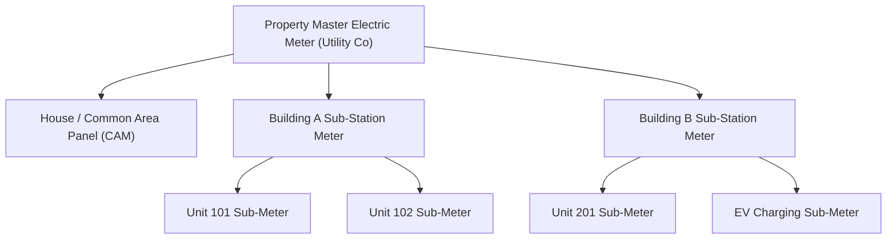

- **Tree Invariants & Virtual Metering**:
  - Every sub-meter references an optional `ParentMeterId`.
  - **Virtual Common Area Sub-Meter**: If common area consumption is not directly sub-metered, the system can dynamically derive CAM usage as:
    $$\text{VirtualCamUsage} = \text{MasterMeterUsage} - \sum_{i=1}^{N} \text{UnitSubMeterUsage}_i$$
  - **Line Loss & Discrepancy Auditing**: When physical CAM meters exist alongside unit sub-meters, electrical line loss and plumbing seepage cause physical discrepancies:
    $$\text{VariancePct} = \frac{\text{MasterUsage} - (\sum \text{UnitSubMeters} + \text{CamMeter})}{\text{MasterUsage}} \times 100\%$$
    If $\text{VariancePct} > \text{LossThresholdPct}$ (default $5.0\%$), an automated **Distribution Leak / Line Loss Audit Alert** is triggered for facility maintenance.

---

### 8.5 Solar Net-Metering & Master Discrepancy Reconciliation

Properties equipped with rooftop solar PV arrays generate distributed energy that offsets the utility company's master bill:

- **`IUtilityDiscrepancyStrategy`**:
  1. **`LandlordAbsorptionStrategy` (Default)**: Renters are billed strictly based on their individual sub-meter consumption evaluated against standard municipal utility tariff rates. All solar net-metering credits, green energy incentives, bulk master volume discounts, and line losses are retained/absorbed directly by the property owner.
  2. **`ProportionalPassThroughStrategy`**: Any net credits (or line loss surcharges) reflected on the utility company's master bill are distributed across active renters in proportion to each renter's share of total metered consumption during the billing period.

---

## 9. Move-In/Move-Out Condition Inspection & Wear-and-Tear Depreciation

### 9.1 The Legal & Domain Problem: Wear-and-Tear vs. Tenant Damage

Security deposit deductions are the single largest source of landlord-tenant friction and municipal small-claims litigation. Statutory property law worldwide mandates two key principles:
1. **Normal Wear and Tear is Non-Deductible**: Natural deterioration resulting from everyday reasonable residential habitation (e.g. minor paint scuffs, carpet flattening along primary footpaths, sun fading of curtains) is a landlord operating expense. Deducting wear and tear from deposits is illegal.
2. **Useful Life & Depreciation**: Landlords may not recover the full replacement cost of aged assets. If a 4-year-old carpet with a 5-year useful life is ruined by tenant negligence, the tenant is liable only for the **remaining useful life value** ($20\%$), not a brand new carpet.

---

### 9.2 `ConditionInspectionAggregate`

- **Identity**: `InspectionId`, `SpaceId`, `LeaseId`, immutable `tenantId`.
- **Properties**:
  - `InspectionType`: `MOVE_IN` (baseline), `MID_LEASE_PERIODIC`, `MOVE_OUT` (final).
  - `InspectionDate`: ISO 8601 timestamp.
  - `Inspector`: `InspectorRole` (`LANDLORD`, `PROPERTY_MANAGER`, `THIRD_PARTY_INSPECTOR`), `InspectorId`, `InspectorName`.
  - `RenterParticipation`: Attended in person (boolean), ReviewWindowExpiryDate (e.g. 7 days post-move-in).
  - `SignatureBlock`:
    - Inspector: `SignatureData`, `SignedAt`.
    - Renter: `SignatureData`, `SignedAt`, `DeviceIp`, `UserAgent`.
  - `InspectionStatus`: `DRAFT` $\to$ `PENDING_RENTER_REVIEW` $\to$ `MUTUALLY_ACCEPTED` | `DISPUTED_ARCHIVED`.
- **Room Sections (`RoomInspectionSection`)**:
  - `RoomType`: `LIVING_ROOM`, `KITCHEN`, `MASTER_BEDROOM`, `BEDROOM_SECONDARY`, `BATHROOM_MASTER`, `BATHROOM_GUEST`, `BALCONY_PATIO`, `HALLWAY_ENTRY`.
  - `ChecklistItems`: Array of inspected elements:
    - *Element Categories*: `WALLS_CEILING`, `FLOORING_CARPET`, `WINDOWS_BLINDS`, `DOORS_LOCKS`, `LIGHTING_ELECTRICAL`, `CABINETS_COUNTERTOPS`, `PLUMBING_FIXTURES`, `APPLIANCES`, `SMOKE_CO_DETECTORS`.
    - *Condition*: `EXCELLENT`, `GOOD`, `FAIR`, `POOR`, `DAMAGED`.
    - *Cleanliness*: `CLEAN`, `NEEDS_CLEANING`, `PROFESSIONAL_CLEAN_REQUIRED`.
    - *Notes*: Inspector observations (e.g. "2-inch gouge on hardwood floor near west wall").
    - *Evidence*: `PhotoUrls[]` with cryptographically verified EXIF timestamps and geo-hash metadata.

---

### 9.3 Inspection State Machine

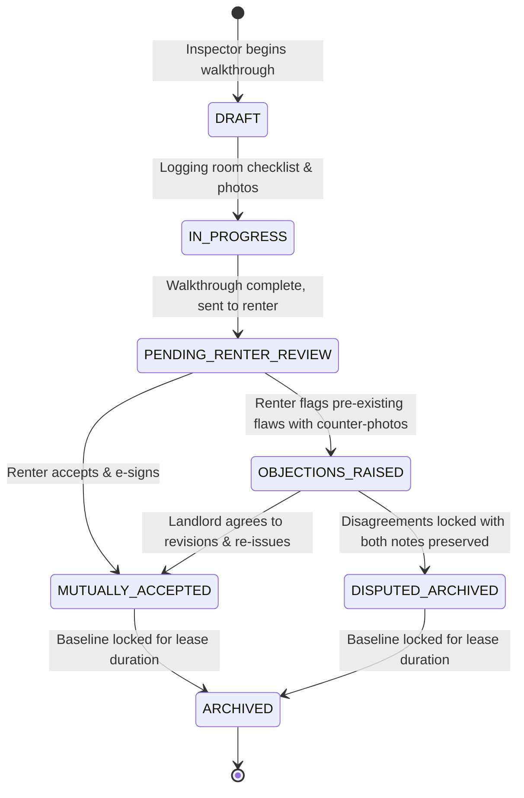

---

### 9.4 `AssetDepreciationSchedule` & Straight-Line Depreciation Engine

To prevent unlawful deposit withholding, Sthanori establishes an IRS/HUD-aligned asset useful life schedule:

| Asset Category | Standard Useful Life | Depreciation Method | Examples of Tenant Damage (Depreciated) | Examples of Normal Wear (Zero Deduction) |
| :--- | :--- | :--- | :--- | :--- |
| **Interior Paint** | 36 Months (3 Years) | Straight-Line Monthly | Large crayon drawings, unapproved dark colors, unauthorized wall anchors | Fading from sunlight, minor scuffs along baseboards |
| **Standard Carpet** | 60 Months (5 Years) | Straight-Line Monthly | Pet urine stains, cigarette burns, large chemical bleach spills | Traffic lane matting, normal furniture indentations |
| **Vinyl / Laminate** | 120 Months (10 Years)| Straight-Line Monthly | Deep water swelling from unreported pet bowl leaks, gouges | Minor superficial surface scuffs |
| **Hardwood Flooring**| 240 Months (20 Years)| Straight-Line Monthly | Deep gouges from dragging metal furniture, dog claw shredding | Gentle gloss dulling in traffic paths |
| **Window Blinds** | 36 Months (3 Years) | Straight-Line Monthly | Broken, bent, or chewed slats | Slight dust accumulation, cord wear |
| **Kitchen Appliances**| 120 Months (10 Years)| Straight-Line Monthly | Cracked glass cooktop, broken crisper drawers due to impact | Motor failure, burner element burnout from age |
| **Drywall / Doors** | Indefinite / 30 Years | Full Repair Recovery | Impact fist holes, door split at hinges | Minor nail holes (< 2mm) from hanging pictures |

#### Mathematical Depreciation Formula:
$$\text{AssetAgeMonths} = \text{MonthsBetween}(\text{AssetInstallDate}, \text{MoveOutDate})$$
$$\text{DepreciationFactor} = \max\left(0, 1 - \frac{\text{AssetAgeMonths}}{\text{UsefulLifeMonths}}\right)$$
$$\text{MaxAllowableTenantCharge} = \text{TotalRepairOrReplacementCost} \times \text{DepreciationFactor}$$

*Worked Example*:
- Tenant damages a 30-month-old carpet. Replacement quote is $\$1,200$.
- Useful life: 60 months.
- $\text{DepreciationFactor} = 1 - (30 / 60) = 0.50$ ($50\%$).
- $\text{MaxAllowableTenantCharge} = \$1,200 \times 0.50 = \$600.00$.
- Landlord absorbs the remaining $\$600.00$ as standard asset depreciation.

---

### 9.5 Automated Move-Out Comparison & Damage Dispute Aggregate

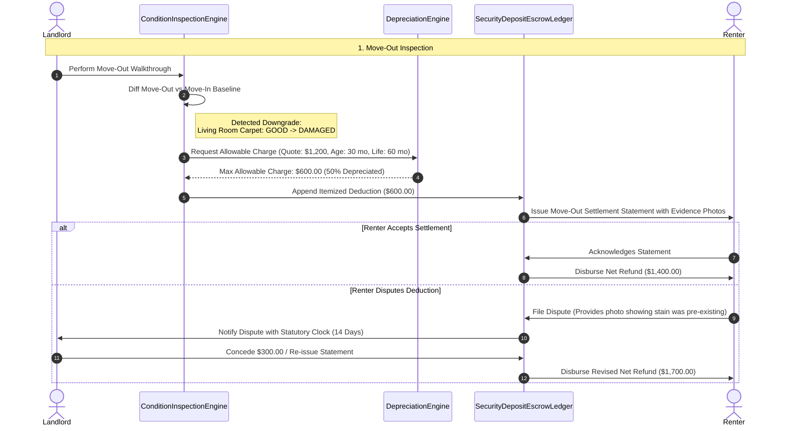

- **`DamageDisputeAggregate`**:
  - `DisputeId`, `EscrowLedgerId`, `LeaseId`, immutable `tenantId`.
  - `DeductionLineItemId`: References specific contested item on MoveOutSettlementStatement.
  - `RenterClaim`: Rebuttal description, counter-evidence photo URLs, proposed reduction amount.
  - `StatutoryDeadline`: Date before which landlord must respond to avoid statutory forfeiture penalties (e.g. 14–21 days).
  - `ResolutionStatus`: `SUBMITTED` $\to$ `UNDER_REVIEW` $\to$ `CONCEDED_IN_FULL` | `PARTIALLY_CONCEDED` | `UPHELD_REJECTED`.
  - `FinancialAdjustment`: Automated credit memo adjusting the deposit escrow settlement balance.

---

## 10. Lease Guarantors, Corporate Master Leases & Deposit Replacement Programs

### 10.1 Lease Guarantors & Co-Signer Framework

When renting applicants exhibit borderline underwriting metrics (e.g. students, foreign nationals, or applicants with income $< 3\times$ rent), landlords mitigate default risk through third-party credit enhancement:

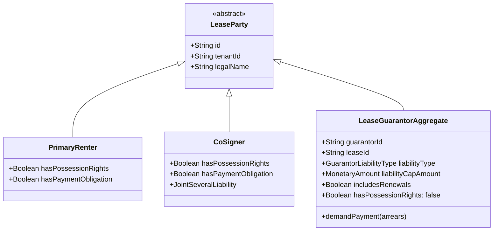

- **Co-Signer vs. Guarantor Distinction (Domain Invariant)**:
  - **`Co-Signer`**: Signs the primary lease contract directly. Has joint-and-several liability for both rent and damages, and possesses the legal right to occupy the premises if desired.
  - **`LeaseGuarantorAggregate`**: Signs an independent, unilateral **Continuing Guarantee Agreement**. A guarantor holds **zero possessory tenancy rights** (cannot demand keys, entry, or access to the premises). Their obligation is purely financial: guaranteeing the tenant's payment defaults, legal fees, and physical damage obligations.
- **Guarantor Invariants**:
  - `LiabilityType`:
    - `UNLIMITED_FINANCIAL`: Guarantees all lease obligations including month-to-month holdovers and lease renewal terms.
    - `CAPPED_AMOUNT`: Financial exposure capped at a fixed maximum sum (e.g. $10,000).
    - `TIME_BOUND`: Guarantee expires automatically after a specified milestone (e.g. after 12 consecutive on-time monthly payments).
  - `GuarantorDemandWorkflow`: Upon tenant default past the grace period, the system generates a formal legal **Guarantor Demand Notice**, notifying the guarantor of accrued arrears before credit agency reporting or legal filings.

---

### 10.2 Corporate Master Leases & Rotating Authorized Occupants

Enterprises, healthcare systems, embassies, and consulting firms often lease residential properties under a corporate entity to house rotating employees:

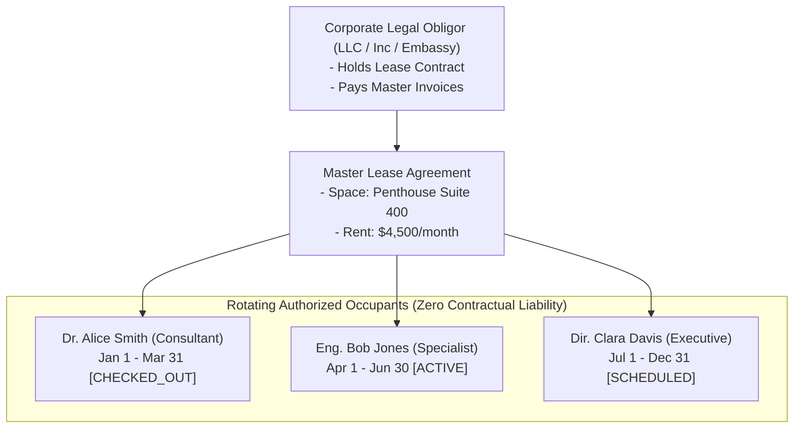

- **Domain Model Structure**:
  - `CorporateObligor`: Legal company name, tax/registration identifier, authorized corporate officer signatory, dedicated corporate accounts payable contact.
  - `AuthorizedOccupantRecord`: Individual human beings assigned to occupy the space.
    - Properties: FullName, ContactPhone, ContactEmail, GovernmentIdVerificationHash, EmergencyContact, AssignedKeyFobId, AccessStartDate, AccessEndDate, Status (`SCHEDULED`, `ACTIVE`, `CHECKED_OUT`).
  - **Occupant Turnover Invariant**: When an occupant departs and a replacement arrives, the underlying `LeaseAgreementAggregate` remains active and untouched. The system executes an **Occupant Rotation Event**, which revokes building access credentials for the departing occupant, issues credentials to the incoming occupant, and archives check-in condition photos without modifying billing schedules.

---

### 10.3 Security Deposit Replacement & Surety Insurance Programs

To eliminate the friction of multi-thousand-dollar cash security deposits, Sthanori supports three interchangeable deposit structures governed by `IDepositGuaranteeStrategy`:

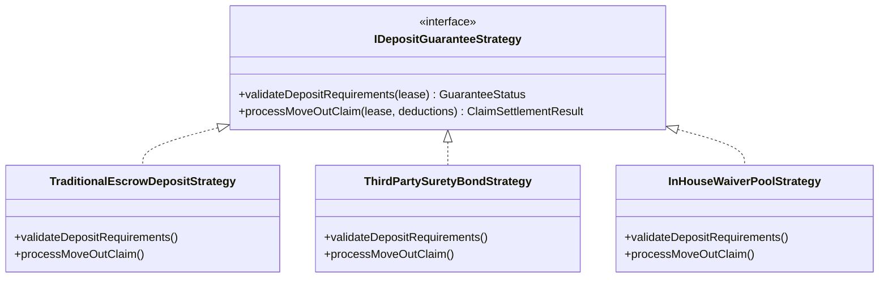

1. **`TraditionalEscrowDepositStrategy`**:
   - Renter tenders a full refundable cash deposit held in an escrow bank account.
   - Move-out deductions reduce deposit refund.
2. **`ThirdPartySuretyBondStrategy` (e.g. Rhino / Jetty / Obligo)**:
   - Renter purchases a commercial surety bond or pays a monthly policy premium (e.g. $12.50/month) directly to a surety provider.
   - Landlord receives a bond guarantee certificate up to a policy limit (e.g. $3,000).
   - *Move-Out Claim Workflow*: When move-out damages occur, the landlord files a claim directly with the surety insurer. The insurer reimburses the landlord. Crucially, the surety retains statutory subrogation rights to collect the reimbursement directly from the tenant.
3. **`InHouseWaiverPoolStrategy` (Landlord Self-Insurance Reserve)**:
   - Landlord charges an optional non-refundable monthly "Security Deposit Waiver Fee" (e.g. $25/month) appended as a recurring invoice add-on.
   - Collected fees pool into an internal **Landlord Risk Reserve**.
   - Upon tenant move-out, unpaid damages up to a designated cap (e.g. $2,000) are absorbed directly by the landlord's risk reserve pool, forgiving the tenant's liability.

