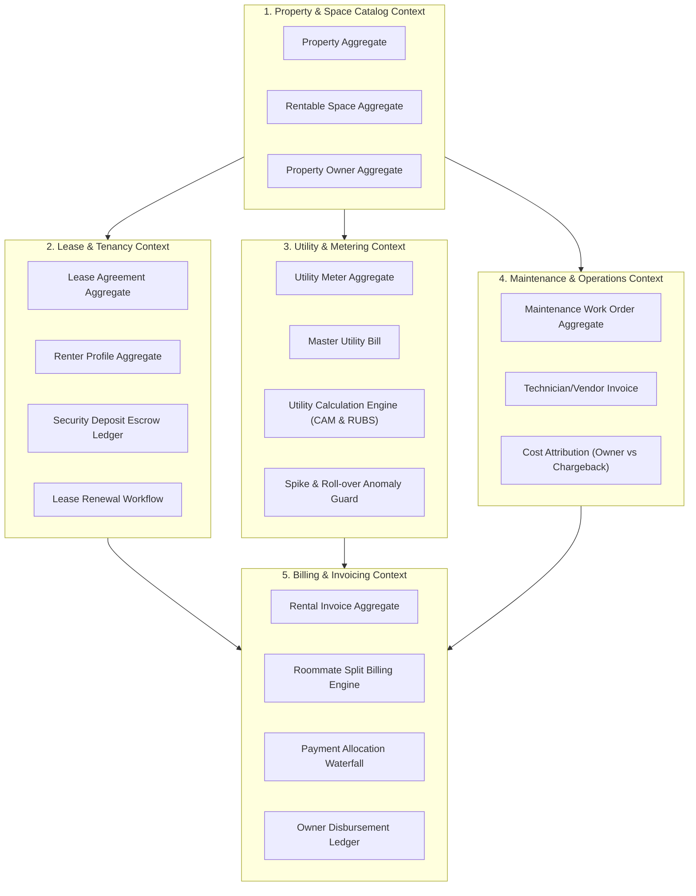
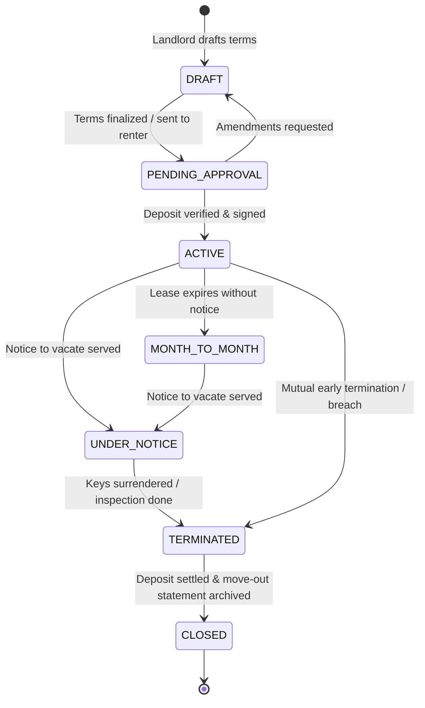
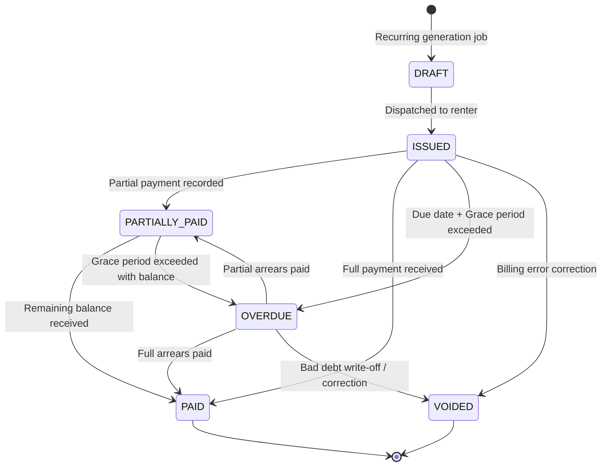
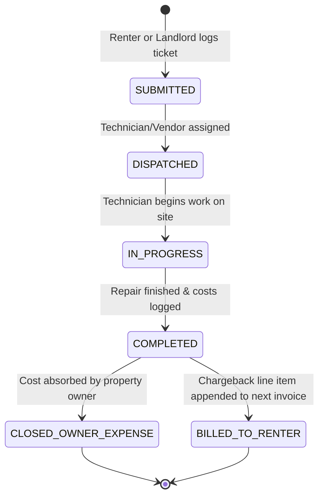
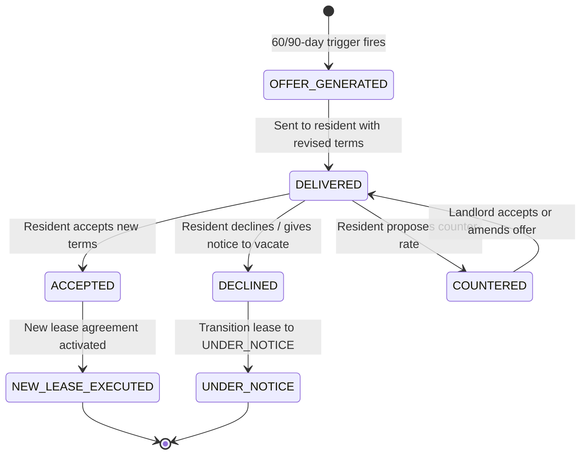
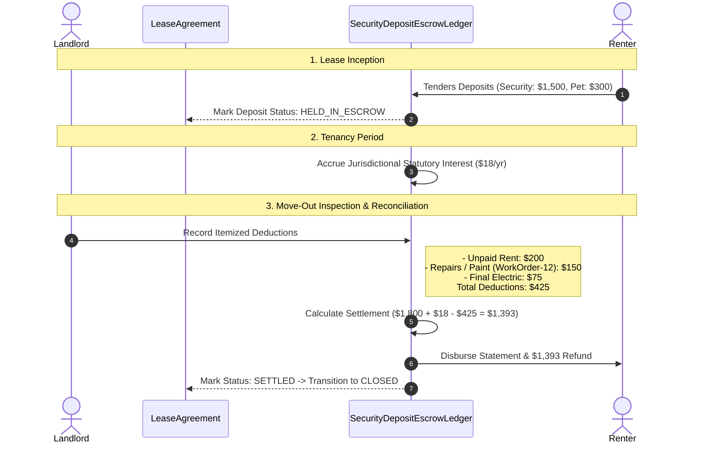

# Comprehensive Domain Analysis & Ubiquitous Language (`DOMAIN_ANALYSIS.md`)

## 1. Executive Summary & Operational Scope

**Sthanori** is a multi-tenant property management and rental billing platform designed to operate seamlessly across three real estate operational modes:

1. **Multi-Property & Multi-Unit Residential**: Traditional apartment buildings, duplexes, and single-family rental complexes where individual units/apartments are leased to residents with sub-meters, flat fees, or proportional utility allocations.
2. **Shared Housing / Co-living**: Houses or large apartments where individual private bedrooms are leased to occupants/roommates who share common utilities (electricity, high-speed WiFi, water, cleaning) split equally or by custom allocation ratios.
3. **Commercial Real Estate**: Office buildings, medical suites, and retail storefronts leased to commercial business entities with Ratio Utility Billing System (RUBS) calculations based on square footage, Common Area Maintenance (CAM) reconciliations, and commercial lease covenants.

---

## 2. Ubiquitous Language (Domain Dictionary)

To eliminate ambiguity across business stakeholders and engineering teams, the following terms constitute the strict Ubiquitous Language of the domain.

### 2.1 Tenancy & Identity Disambiguation (Critical Invariant)

> [!IMPORTANT]
> **SaaS Tenancy vs. Real Estate Tenancy**:
> - **`TenantId` (SaaS Workspace)**: The software-level isolation identifier representing the Landlord's account or Property Management Company subscribing to the Sthanori platform. Enforced at the database Row-Level Security (RLS) layer.
> - **`Renter` / `LeaseParty` (Real Estate)**: The physical individual or legal business entity leasing a physical property or space. To prevent catastrophic naming collisions, **the word "Tenant" is never used in domain entities to refer to a renting customer**.

| Domain Term | Definition | Context / Role |
| :--- | :--- | :--- |
| **Landlord** / **PropertyManager** | The legal property owner or managing agency operating the SaaS workspace (`tenantId`). | Operator / Creditor |
| **Property Owner** | External investor or property deed holder who contracts a Property Manager to oversee assets. | Asset Owner / Payee |
| **Owner Disbursement** | Periodic payout transfer from Property Manager to Property Owner (Gross Rent - Management Fees - Repairs). | Financial Outflow |
| **Management Fee** | Percentage (e.g. 8%) or flat commission deducted by Property Manager for management services. | Operating Revenue |
| **Renter** (Base Entity) | The generic counter-party entering into a lease agreement. | Debtor / Customer |
| **Resident** | A physical human being leasing a residential apartment or house. | Residential Mode |
| **Occupant** / **Roommate** | An individual leasing an individual room within a shared residential co-living space. | Co-living Mode |
| **Commercial Client** | A registered business entity leasing office, retail, or industrial space. | Commercial Mode |
| **Property** | A physical real estate asset, parcel, or building located at a validated geographic address. | Real Estate Asset |
| **Rentable Space** | A rentable demarcation within a property (an entire apartment, a specific room, or a commercial suite). | Unit of Inventory |
| **Lease Agreement** | The binding contractual agreement between Landlord and Renter(s) defining terms, rent, and rules. | Contractual Aggregate |
| **Rent Escalation** | Scheduled contractual rent adjustments over multi-year leases (stepped or CPI-indexed). | Price Schedule |
| **Renewal Proposal** | Formal offer extended to renter prior to lease expiry proposing new terms or rate revisions. | Lifecycle Offer |
| **Security Deposit** | Funds collected at lease inception held in escrow to guarantee against property damage or default. | Escrow Liability |
| **Escrow Account** | Dedicated bank account segregating tenant deposit liabilities from operational cash. | Fiduciary Ledger |
| **Statutory Interest** | Jurisdictional interest accrued on held deposits payable or creditable to the renter. | Accrued Liability |
| **Utility** | An ongoing service (electricity, water, gas, internet, trash) consumed in a space. | Service Resource |
| **Sub-Meter** | A physical or virtual measurement device dedicated to a single rentable space tracking usage units. | Metering Device |
| **Master Bill** | A consolidated utility invoice issued by a city or utility provider for an entire property. | Aggregated Cost |
| **CAM (Common Area Maint.)**| House utility & maintenance expenses for shared spaces (hallway lighting, lobby HVAC, elevators). | Operational Cost |
| **RUBS (Ratio Utility Billing)**| Mathematical formula distributing a master bill across units based on square footage or occupant count. | Allocation Algorithm |
| **Spike Anomaly Alert** | Flag triggered when a meter reading deviates significantly from historical rolling averages. | Verification Gate |
| **Maintenance Work Order** | Operational ticket tracking repair requests, technician dispatch, parts costs, and labor. | Maintenance Context |
| **Tenant Chargeback** | Maintenance expense billed directly to renter's invoice due to tenant negligence or damages. | Invoiced Cost |
| **Rental Invoice** | Periodic billing statement detailing base rent, itemized utilities, recurring fees, and adjustments. | Financial Statement |
| **Split Invoicing** | Splitting a single joint-and-several lease invoice into individualized roommate bills. | Multi-Renter Strategy |
| **Payment Waterfall** | Priority hierarchy governing how partial payments are allocated across invoice line items. | Accounting Protocol |
| **Grace Period** | Allowable window of days between invoice due date and late fee assessment. | Temporal Rule |
| **Proration** | Calculation of fractional rent when tenancy begins or terminates mid-billing cycle. | Financial Adjustment |

---

## 3. Bounded Contexts & Context Map

---

## 4. Aggregate Roots & Entity Invariants

### 4.1 `PropertyAggregate`
- **Identity**: `PropertyId`, immutable `tenantId`.
- **Properties**: Name, Address (Street, City, State, PostalCode, Country), `PropertyType` (`RESIDENTIAL_MULTIFAMILY`, `SINGLE_FAMILY`, `CO_LIVING`, `COMMERCIAL`, `MIXED_USE`), `OwnerId` (nullable if self-managed), `ManagementFeeConfig` (percentage or flat).
- **Invariants**:
  - Address must be valid and non-empty.
  - A Property encapsulates zero or more `RentableSpace` entities.
  - Deleting a Property is prohibited if active leases exist.

### 4.2 `PropertyOwnerAggregate`
- **Identity**: `OwnerId`, immutable `tenantId`.
- **Properties**: LegalName, ContactEmail, ContactPhone, TaxId, BankDisbursementDetails, DefaultManagementFeePct (e.g. 8.00%).
- **Invariants**:
  - Bank routing and account details must be encrypted at rest.
  - Owner statements must balance: $\text{Disbursement} = \text{Gross Rent} - \text{Management Fees} - \text{Owner Maintenance Expenses}$.

### 4.3 `RentableSpaceAggregate` (Unit / Room / Suite)
- **Identity**: `SpaceId`, `PropertyId`, immutable `tenantId`.
- **Properties**: SpaceNumber/Label (e.g. "Apt 4B", "Bedroom 2", "Suite 300"), `SpaceType` (`WHOLE_APARTMENT`, `PRIVATE_ROOM`, `COMMERCIAL_SUITE`), FloorAreaSqFt, MaxOccupants, BaseRentAmount, Status (`VACANT`, `OCCUPIED`, `MAINTENANCE`, `RESERVED`), `ParentUnitId` (for co-living rooms grouped in an apartment).
- **Invariants**:
  - Status cannot be set to `VACANT` if an active `LeaseAgreement` covers the current date.
  - Square footage must be greater than zero.

### 4.4 `RenterProfileAggregate`
- **Identity**: `RenterId`, immutable `tenantId`.
- **Properties**: PrimaryName, ContactEmail, ContactPhone, `RenterType` (`RESIDENTIAL_RESIDENT`, `CO_LIVING_OCCUPANT`, `COMMERCIAL_CLIENT`), TaxOrBusinessId (for commercial), EmergencyContacts, CreditBalance.
- **Invariants**:
  - Email format must be validated via standard email regex schema.
  - Credit balance represents overpayments and must be automatically applied to future invoices.

### 4.5 `LeaseAgreementAggregate`
- **Identity**: `LeaseId`, `SpaceId`, immutable `tenantId`.
- **Properties**:
  - Primary Renter and co-signers/roommates list (`RenterId[]` with individual split percentages if configured).
  - Dates: `StartDate`, `EndDate` (nullable if month-to-month), `MoveInDate`, `MoveOutDate`.
  - Financial Terms: BaseRentAmount, Currency, BillingCycleDay (e.g., 1st), PaymentGracePeriodDays.
  - `RentEscalationSchedule`: Scheduled future rent adjustments: `[{ effectiveDate: string, newAmount: number, reason: string }]`.
  - Security Deposit: AmountRequired, AmountPaid, Status (`PENDING`, `HELD_IN_ESCROW`, `SETTLED`).
  - Lifecycle Status: `DRAFT`, `PENDING_APPROVAL`, `ACTIVE`, `UNDER_NOTICE`, `EXPIRED`, `MONTH_TO_MONTH`, `TERMINATED`, `CLOSED`.
- **Invariants**:
  - `EndDate` must be strictly after `StartDate`.
  - Base rent must be represented as a positive integer in minor currency units (e.g. cents).
  - Roommate split percentages (if configured) must sum exactly to 100.00%.

### 4.6 `SecurityDepositEscrowLedger`
- **Identity**: `EscrowLedgerId`, `LeaseId`, immutable `tenantId`.
- **Deposit Breakdown**: Itemized lines by category:
  - `SECURITY_DEPOSIT` (general damage/rent default)
  - `PET_DEPOSIT` (pet damage guarantee)
  - `KEY_ACCESS_DEPOSIT` (fob/key guarantee)
  - `ADVANCE_LAST_MONTH_RENT` (prepaid final month rent)
- **Properties**: EscrowBankAccountId, TotalCollected, AccruedInterestAmount, StatutoryInterestRatePct, Status (`HELD_IN_ESCROW`, `RECONCILING`, `SETTLED`).
- **Move-Out Settlement (`MoveOutSettlementStatement`)**:
  - Itemized deductions: Unpaid Rent, Outstanding Utilities, Repair Damages (with photos/work order IDs), Cleaning Fees.
  - Settlement Formula: $\text{NetRefund} = \text{TotalCollected} + \text{AccruedInterest} - \text{TotalDeductions}$.

### 4.7 `UtilityMeterAggregate` & Master Bills
- **Identity**: `MeterId`, `SpaceId` (or `PropertyId` for master meter), immutable `tenantId`.
- **Properties**: `UtilityType` (`ELECTRICITY`, `WATER`, `GAS`, `INTERNET`, `TRASH`), SerialNumber, `BillingModel` (`SUB_METER`, `EQUAL_SPLIT`, `RUBS_SQFT`, `RUBS_OCCUPANTS`, `FLAT_FEE`), UnitRate, `CamAllowancePct` (e.g. 10% deducted for common areas).
- **Reading History**: `MeterReading` (ReadingDate, MeterValue, ProofPhotoUrl, InspectorId, `AnomalyStatus`: `NORMAL` | `FLAGGED_SPIKE` | `VERIFIED`).
- **Invariants**:
  - If current reading < previous reading, requires explicit `MeterResetFlag` or is rejected.
  - If current consumption exceeds 200% of rolling 3-reading average, flagged as `FLAGGED_SPIKE` requiring supervisor approval before invoice generation.

### 4.8 `MaintenanceWorkOrderAggregate`
- **Identity**: `WorkOrderId`, `SpaceId`, `PropertyId`, immutable `tenantId`.
- **Properties**: Title, Description, Category (`PLUMBING`, `HVAC`, `ELECTRICAL`, `APPLIANCE`, `STRUCTURAL`, `LOCK_SECURITY`), Priority (`LOW`, `MEDIUM`, `HIGH`, `EMERGENCY`), ReportedByRenterId, AssignedVendorId.
- **Financial Attribution**:
  - `CostAttribution`: `LANDLORD_EXPENSE` (owner operating cost) vs. `TENANT_CHARGEBACK` (tenant liability).
  - EstimatedCost, FinalLaborCost, FinalPartsCost, TotalCost, SupportingInvoices/Photos.
  - `InvoicedStatus`: `NOT_INVOICED` | `INVOICED_TO_RENTER` | `DEDUCTED_FROM_OWNER`.
- **Status**: `SUBMITTED` $\to$ `DISPATCHED` $\to$ `IN_PROGRESS` $\to$ `COMPLETED` $\to$ `CLOSED`.

### 4.9 `RentalInvoiceAggregate`
- **Identity**: `InvoiceId`, `LeaseId`, immutable `tenantId`.
- **Properties**: InvoiceNumber, IssueDate, DueDate, PeriodStartDate, PeriodEndDate, `RecipientRenterId` (supports roommate split invoices), Status (`DRAFT`, `ISSUED`, `PARTIALLY_PAID`, `PAID`, `OVERDUE`, `VOIDED`).
- **Line Items (`InvoiceLineItem`)**:
  - `Type`: `BASE_RENT`, `UTILITY_ELECTRICITY`, `UTILITY_WATER`, `UTILITY_INTERNET`, `CAM_FEE`, `MAINTENANCE_CHARGEBACK`, `LATE_FEE`, `PARKING`, `DISCOUNT`, `CUSTOM`.
  - Description, Quantity, UnitPrice, TotalAmount.
- **Payments (`PaymentReceipt`)**:
  - ReceiptId, AmountPaid, PaymentDate, Method (`CASH`, `CHECK`, `BANK_TRANSFER`, `CREDIT_CARD`), ReferenceNumber, AllocatedBreakdown.
- **Invariants**:
  - Total amount equals the sum of line items.
  - Balance Due equals Total Amount minus Sum of allocated Payments.
  - Status automatically transitions to `PAID` when Balance Due reaches 0.

---

## 5. Domain Strategy Patterns (Configurable Algorithms)

In strict alignment with ADR-007, algorithmic variations are isolated behind owned domain strategy interfaces, resolved via application factories and feature flags.

```mermaid
classDiagram
    class IUtilityCalculationStrategy {
        <<interface>>
        +calculate(space, readings, masterBill, camConfig) UtilityCharge
    }
    class SubMeterCalculationStrategy {
        +calculate()
    }
    class EqualSplitCalculationStrategy {
        +calculate()
    }
    class RubsSqftCalculationStrategy {
        +calculate()
    }
    class FlatFeeCalculationStrategy {
        +calculate()
    }

    IUtilityCalculationStrategy <|.. SubMeterCalculationStrategy
    IUtilityCalculationStrategy <|.. EqualSplitCalculationStrategy
    IUtilityCalculationStrategy <|.. RubsSqftCalculationStrategy
    IUtilityCalculationStrategy <|.. FlatFeeCalculationStrategy

    class IRoommateBillingStrategy {
        <<interface>>
        +generateInvoices(lease, period) RentalInvoice[]
    }
    class JointSeveralSplitInvoiceStrategy {
        +generateInvoices()
    }
    class SingleMasterInvoiceStrategy {
        +generateInvoices()
    }
    class IndividualRoomLeaseStrategy {
        +generateInvoices()
    }

    IRoommateBillingStrategy <|.. JointSeveralSplitInvoiceStrategy
    IRoommateBillingStrategy <|.. SingleMasterInvoiceStrategy
    IRoommateBillingStrategy <|.. IndividualRoomLeaseStrategy

    class IPaymentAllocationStrategy {
        <<interface>>
        +allocate(invoice, paymentAmount) AllocationResult
    }
    class FifoWaterfallAllocationStrategy {
        +allocate()
    }
    class ProportionalAllocationStrategy {
        +allocate()
    }
    class StrictFullAllocationStrategy {
        +allocate()
    }

    IPaymentAllocationStrategy <|.. FifoWaterfallAllocationStrategy
    IPaymentAllocationStrategy <|.. ProportionalAllocationStrategy
    IPaymentAllocationStrategy <|.. StrictFullAllocationStrategy
```

### 5.1 `IUtilityCalculationStrategy` (with CAM Deduction)
- **`SubMeterCalculationStrategy`**: Charge = $(Reading_{current} - Reading_{previous}) \times RatePerUnit$.
- **`EqualSplitCalculationStrategy`**: Charge = $(MasterBill \times (1 - CamAllowancePct)) / ActiveOccupantCount$.
- **`RubsSqftCalculationStrategy`**: Charge = $(MasterBill \times (1 - CamAllowancePct)) \times (SpaceSqFt / TotalPropertySqFt)$.
- **`FlatFeeCalculationStrategy`**: Fixed recurring amount defined in lease agreement.

### 5.2 `IRoommateBillingStrategy`
- **`JointSeveralSplitInvoiceStrategy`**: Generates individualized invoices per roommate based on configured split percentages (e.g. 50/50), while retaining joint legal liability on the underlying lease.
- **`SingleMasterInvoiceStrategy`**: Generates one master invoice for the entire unit; roommates make partial payments toward the shared balance.
- **`IndividualRoomLeaseStrategy`**: Generates an independent invoice for each private bedroom lease, with common utilities split among current active occupants.

### 5.3 `IPaymentAllocationStrategy`
- **`FifoWaterfallAllocationStrategy` (Default)**: Payments clear oldest outstanding invoices first. Within an invoice, funds clear `BASE_RENT` first, followed by `UTILITIES`, then `MAINTENANCE_CHARGEBACKS`, then `LATE_FEES`.
- **`ProportionalAllocationStrategy`**: Funds distributed pro-rata across all unpaid line items based on their percentage of the remaining balance.
- **`StrictFullAllocationStrategy`**: Rejects partial allocation; holds funds in unapplied credit until full invoice amount is satisfied.

### 5.4 `ILateFeeStrategy`
- **`FlatLateFeeStrategy`**: Assesses a single fixed amount (e.g. $50) if balance remains unpaid after the grace period.
- **`PercentageLateFeeStrategy`**: Assesses a percentage (e.g. 5%) of unpaid base rent.
- **`DailyAccruingLateFeeStrategy`**: Assesses a daily rate (e.g. $10/day) beginning day after grace period up to a statutory ceiling.
- **`NoLateFeeStrategy`**: Zero late fee assessed.

### 5.5 `IProrationStrategy`
- **`ActualDaysProrationStrategy`**: $DailyRate = MonthlyRent / DaysInActualMonth$. Partial Month = $DailyRate \times DaysOccupied$.
- **`ThirtyDayStandardProrationStrategy` (Banker's Rule)**: $DailyRate = MonthlyRent / 30$. Partial Month = $DailyRate \times DaysOccupied$.

### 5.6 `IMeterValidationPolicy`
- **`DecreasingReadingPolicy`**: Blocks any reading where $Reading_{curr} < Reading_{prev}$ unless an explicit `MeterResetEvent` is provided.
- **`SpikeDetectionPolicy`**: Automatically flags readings exceeding 200% of the 3-reading rolling average as `FLAGGED_SPIKE`, holding invoice dispatch until supervisor confirmation.
- **`PermissivePolicy`**: Records readings without automated threshold blocks.

---

## 6. State Machine Specifications

### 6.1 Lease Agreement State Machine

### 6.2 Rental Invoice State Machine

### 6.3 Maintenance Work Order State Machine

### 6.4 Lease Renewal Offer State Machine

---

## 7. Security Deposit Escrow & Move-Out Settlement

