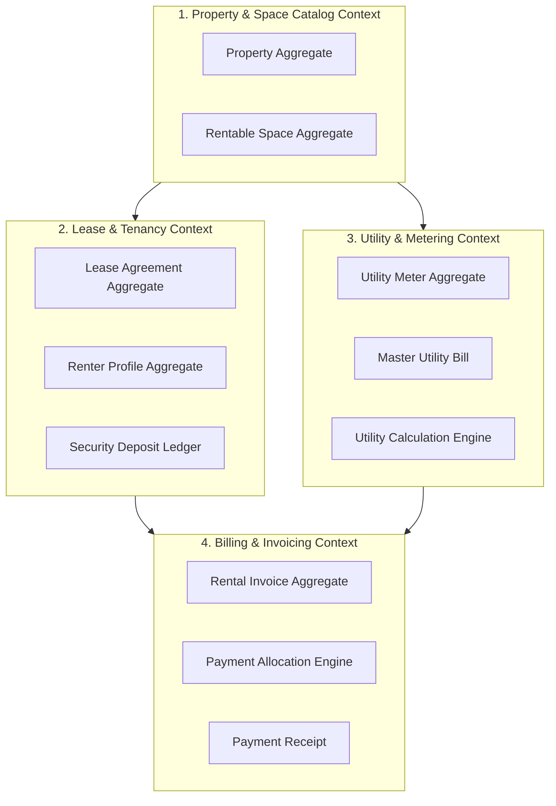
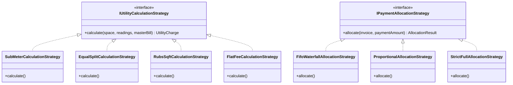
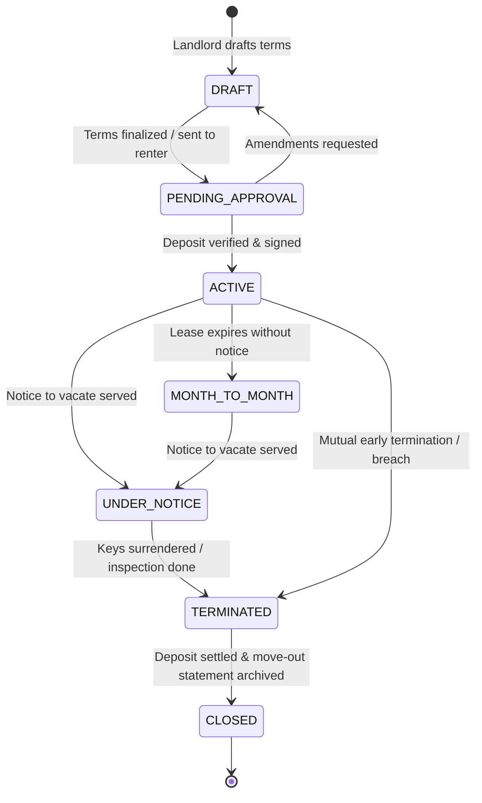
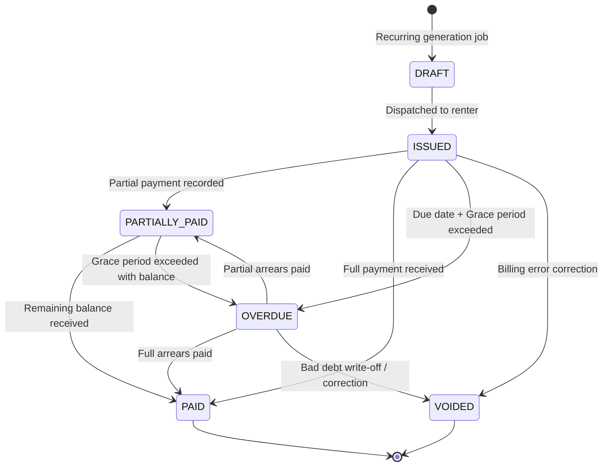
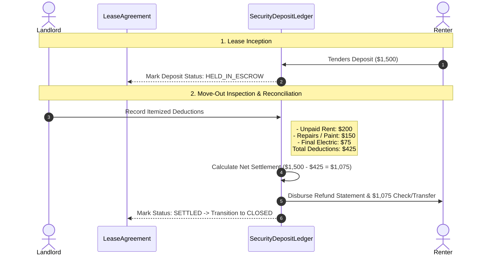

# Domain Analysis & Ubiquitous Language (`DOMAIN_ANALYSIS.md`)

## 1. Executive Summary & Operational Scope

**Sthanori** is a multi-tenant property management and rental billing platform designed to operate seamlessly across three real estate operational modes:

1. **Multi-Property & Multi-Unit Residential**: Traditional apartment buildings, duplexes, and single-family rental complexes where individual units/apartments are leased to residents with sub-meters, flat fees, or proportional utility allocations.
2. **Shared Housing / Co-living**: Houses or large apartments where individual private bedrooms are leased to occupants/roommates who share common utilities (electricity, high-speed WiFi, water, cleaning) split equally or by custom allocation ratios.
3. **Commercial Real Estate**: Office buildings, medical suites, and retail storefronts leased to commercial business entities with Ratio Utility Billing System (RUBS) calculations based on square footage and commercial lease covenants.

---

## 2. Ubiquitous Language (Domain Dictionary)

To eliminate ambiguity across business stakeholders and engineering teams, the following terms constitute the strict Ubiquitous Language of the domain.

### 2.1 Tenancy & Identity Disambiguation (Critical Invariant)

> [!IMPORTANT]
> **SaaS Tenancy vs. Real Estate Tenancy**:
> - **`TenantId` (SaaS Workspace)**: The software-level isolation identifier representing the Landlord's account or Property Management Company subscribing to the Sthanori platform. Enforced at the database Row-Level Security (RLS) layer.
> - **`Renter` / `LeaseParty` (Real Estate)**: The physical individual or legal business entity leasing a physical property or space. To prevent catastrophic naming collisions, **the word "Tenant" is never used in domain entities to refer to a renting customer**.

| Domain Term | Definition | Context / Role |
| :--- | :--- | :--- |
| **Landlord** / **PropertyManager** | The legal property owner or managing agency operating the SaaS workspace (`tenantId`). | Operator / Creditor |
| **Renter** (Base Entity) | The generic counter-party entering into a lease agreement. | Debtor / Customer |
| **Resident** | A physical human being leasing a residential apartment or house. | Residential Mode |
| **Occupant** / **Roommate** | An individual leasing an individual room within a shared residential co-living space. | Co-living Mode |
| **Commercial Client** | A registered business entity leasing office, retail, or industrial space. | Commercial Mode |
| **Property** | A physical real estate asset, parcel, or building located at a validated geographic address. | Real Estate Asset |
| **Rentable Space** | A rentable demarcation within a property (an entire apartment, a specific room, or a commercial suite). | Unit of Inventory |
| **Lease Agreement** | The binding contractual agreement between Landlord and Renter(s) defining terms, rent, and rules. | Contractual Aggregate |
| **Security Deposit** | Funds collected at lease inception held in escrow to guarantee against property damage or default. | Escrow Liability |
| **Utility** | An ongoing service (electricity, water, gas, internet, trash) consumed in a space. | Service Resource |
| **Sub-Meter** | A physical or virtual measurement device dedicated to a single rentable space tracking usage units. | Metering Device |
| **Master Bill** | A consolidated utility invoice issued by a city or utility provider for an entire property. | Aggregated Cost |
| **RUBS (Ratio Utility Billing)** | Mathematical formula distributing a master bill across units based on square footage or occupant count. | Allocation Algorithm |
| **Rental Invoice** | Periodic billing statement detailing base rent, itemized utilities, recurring fees, and adjustments. | Financial Statement |
| **Payment Waterfall** | Priority hierarchy governing how partial payments are allocated across invoice line items. | Accounting Protocol |
| **Grace Period** | Allowable window of days between invoice due date and late fee assessment. | Temporal Rule |
| **Proration** | Calculation of fractional rent when tenancy begins or terminates mid-billing cycle. | Financial Adjustment |

---

## 3. Bounded Contexts & Context Map

---

## 4. Aggregate Roots & Entity Invariants

### 4.1 `PropertyAggregate`
- **Identity**: `PropertyId`, immutable `tenantId`.
- **Properties**: Name, Address (Street, City, State, PostalCode, Country), `PropertyType` (`RESIDENTIAL_MULTIFAMILY`, `SINGLE_FAMILY`, `CO_LIVING`, `COMMERCIAL`, `MIXED_USE`).
- **Invariants**:
  - Address must be valid and non-empty.
  - A Property encapsulates zero or more `RentableSpace` entities.
  - Deleting a Property is prohibited if active leases exist.

### 4.2 `RentableSpaceAggregate` (Unit / Room / Suite)
- **Identity**: `SpaceId`, `PropertyId`, immutable `tenantId`.
- **Properties**: SpaceNumber/Label (e.g. "Apt 4B", "Bedroom 2", "Suite 300"), `SpaceType` (`WHOLE_APARTMENT`, `PRIVATE_ROOM`, `COMMERCIAL_SUITE`), FloorAreaSqFt, MaxOccupants, BaseRentAmount, Status (`VACANT`, `OCCUPIED`, `MAINTENANCE`, `RESERVED`).
- **Invariants**:
  - Status cannot be set to `VACANT` if an active `LeaseAgreement` is tied to this space.
  - Square footage must be greater than zero.

### 4.3 `RenterProfileAggregate`
- **Identity**: `RenterId`, immutable `tenantId`.
- **Properties**: PrimaryName, ContactEmail, ContactPhone, `RenterType` (`RESIDENTIAL_RESIDENT`, `CO_LIVING_OCCUPANT`, `COMMERCIAL_CLIENT`), TaxOrBusinessId (optional for commercial), EmergencyContacts.
- **Invariants**:
  - Email format must be validated via standard email regex schema.
  - Multiple active leases can be linked to a single renter profile across different timeframes.

### 4.4 `LeaseAgreementAggregate`
- **Identity**: `LeaseId`, `SpaceId`, immutable `tenantId`.
- **Properties**:
  - Primary Renter ID and co-signers/roommates list (`RenterId[]`).
  - Dates: `StartDate`, `EndDate` (nullable if month-to-month), `MoveInDate`, `MoveOutDate`.
  - Financial Terms: BaseRentAmount, Currency, BillingCycleDay (e.g., 1st), PaymentGracePeriodDays.
  - Security Deposit: AmountRequired, AmountPaid, Status (`PENDING`, `HELD_IN_ESCROW`, `SETTLED`).
  - Lifecycle Status: `DRAFT`, `PENDING_APPROVAL`, `ACTIVE`, `UNDER_NOTICE`, `EXPIRED`, `MONTH_TO_MONTH`, `TERMINATED`, `CLOSED`.
- **Invariants**:
  - `EndDate` must be strictly after `StartDate`.
  - Base rent must be represented as a positive integer in minor units (e.g. cents).
  - Transition to `ACTIVE` requires verified space vacancy.

### 4.5 `UtilityMeterAggregate` & Master Bills
- **Identity**: `MeterId`, `SpaceId` (or `PropertyId` for master meter), immutable `tenantId`.
- **Properties**: `UtilityType` (`ELECTRICITY`, `WATER`, `GAS`, `INTERNET`, `TRASH`), SerialNumber, `BillingModel` (`SUB_METER`, `EQUAL_SPLIT`, `RUBS_SQFT`, `RUBS_OCCUPANTS`, `FLAT_FEE`), UnitRate.
- **Reading History**: `MeterReading` (ReadingDate, MeterValue, ProofPhotoUrl, InspectorId).
- **Invariants**:
  - Successive meter readings must be monotonically non-decreasing ($Reading_{current} \ge Reading_{previous}$) unless a verified meter reset is flagged.

### 4.6 `RentalInvoiceAggregate`
- **Identity**: `InvoiceId`, `LeaseId`, immutable `tenantId`.
- **Properties**: InvoiceNumber, IssueDate, DueDate, PeriodStartDate, PeriodEndDate, Status (`DRAFT`, `ISSUED`, `PARTIALLY_PAID`, `PAID`, `OVERDUE`, `VOIDED`).
- **Line Items (`InvoiceLineItem`)**:
  - `Type`: `BASE_RENT`, `UTILITY_ELECTRICITY`, `UTILITY_WATER`, `UTILITY_INTERNET`, `LATE_FEE`, `PARKING`, `DISCOUNT`, `CUSTOM`.
  - Description, Quantity, UnitPrice, TotalAmount.
- **Payments (`PaymentReceipt`)**:
  - ReceiptId, AmountPaid, PaymentDate, Method (`CASH`, `CHECK`, `BANK_TRANSFER`, `CREDIT_CARD`), ReferenceNumber, AllocatedBreakdown.
- **Invariants**:
  - Total amount equals the sum of line items.
  - Balance Due equals Total Amount minus Sum of allocated Payments.
  - Status automatically transitions to `PAID` when Balance Due reaches 0.

---

## 5. Domain Strategy Patterns (Configurable Algorithms)

In strict alignment with ADR-007, algorithmic variations are isolated behind owned domain strategy interfaces, resolved via application factories and feature flags.

### 5.1 `IUtilityCalculationStrategy`
- **`SubMeterCalculationStrategy`**: Charge = $(Reading_{current} - Reading_{previous}) \times RatePerUnit$.
- **`EqualSplitCalculationStrategy`**: Charge = $MasterBillAmount / ActiveOccupantCount$.
- **`RubsSqftCalculationStrategy`**: Charge = $MasterBillAmount \times (SpaceSqFt / TotalPropertySqFt)$.
- **`FlatFeeCalculationStrategy`**: Fixed recurring amount defined in lease agreement.

### 5.2 `IPaymentAllocationStrategy`
- **`FifoWaterfallAllocationStrategy` (Default)**: Payments clear oldest outstanding invoices first. Within an invoice, funds clear `BASE_RENT` first, followed by `UTILITIES`, then `LATE_FEES` and other charges.
- **`ProportionalAllocationStrategy`**: Funds distributed pro-rata across all unpaid line items based on their percentage of the remaining balance.
- **`StrictFullAllocationStrategy`**: Rejects partial allocation; holds funds in unapplied credit until full invoice amount is satisfied.

### 5.3 `ILateFeeStrategy`
- **`FlatLateFeeStrategy`**: Assesses a single fixed amount (e.g. $50) if balance remains unpaid after the grace period.
- **`PercentageLateFeeStrategy`**: Assesses a percentage (e.g. 5%) of unpaid base rent.
- **`DailyAccruingLateFeeStrategy`**: Assesses a daily rate (e.g. $10/day) beginning day after grace period up to a statutory ceiling.
- **`NoLateFeeStrategy`**: Zero late fee assessed.

### 5.4 `IProrationStrategy`
- **`ActualDaysProrationStrategy`**: $DailyRate = MonthlyRent / DaysInActualMonth$. Partial Month = $DailyRate \times DaysOccupied$.
- **`ThirtyDayStandardProrationStrategy` (Banker's Rule)**: $DailyRate = MonthlyRent / 30$. Partial Month = $DailyRate \times DaysOccupied$.

---

## 6. State Machine Specifications

### 6.1 Lease Agreement State Machine

### 6.2 Rental Invoice State Machine

---

## 7. Security Deposit Escrow & Move-Out Settlement

