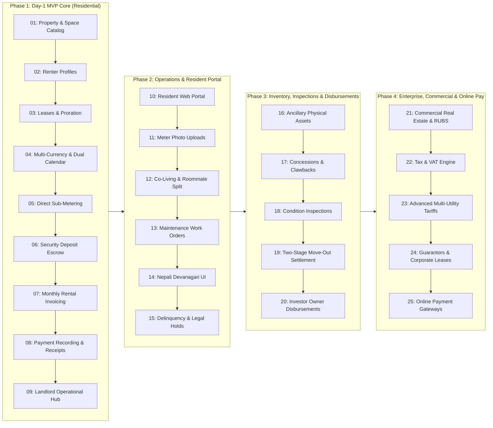

# Prioritized Issues Backlog: Single Deployable Units Roadmap

## 1. Prioritization & Phasing Architecture

This document establishes the canonical execution order for all requirements in [`docs/BUSINESS_REQUIREMENTS.md`](file:///home/prosubodh/projects/sthanori/docs/BUSINESS_REQUIREMENTS.md) and [`docs/DOMAIN_ANALYSIS.md`](file:///home/prosubodh/projects/sthanori/docs/DOMAIN_ANALYSIS.md).

In strict accordance with `AGENTS.md`:
- **Single Deployable Unit**: Every issue is a full-stack, vertically sliced capability delivering tangible business value on its own (never a horizontal layer).
- **London School Outside-In TDD**: Driven by acceptance tests and sibling unit tests with 100.00% coverage.
- **Hexagonal Architecture**: Zero external dependencies in Domain Core, pure constructor DI, and owned boundary ports.

---

## 2. Master Roadmap Breakdown

---

## 3. Issue Specifications (In Order of Deployment)

### Phase 1: Day-1 MVP Core (Residential Rental & Billing Engine)

#### 1. `[P1-MVP-01] Property & Rentable Space Catalog (Residential Units)`
- **Business Value**: Enables landlords to configure residential properties and rentable spaces (apartments, studios, single-family units) with base rent, square footage, occupancy limits, and operational status (`VACANT`, `OCCUPIED`, `MAINTENANCE`, `RESERVED`).
- **Single Deployable Unit**: API endpoints + UI forms for creating/updating properties, spaces, and viewing real-time occupancy status.
- **BRD Mapping**: FR-1.1, FR-1.2, FR-1.3.

#### 2. `[P1-MVP-02] Renter & Resident Profile Directory`
- **Business Value**: Centralized directory of residents with validated contact info and emergency details, establishing the counterparty profile required for leasing while preserving cross-lease payment credibility.
- **Single Deployable Unit**: Renter profile creation, workspace-unique email validation (`tenantId`), search/filter directory, and contact management.
- **BRD Mapping**: FR-2.1, FR-2.2, FR-2.3.

#### 3. `[P1-MVP-03] Core Residential Lease Agreement & Rent Proration Engine`
- **Business Value**: Legally binding lease agreement lifecycle (`DRAFT` $\to$ `ACTIVE` $\to$ `TERMINATED`), calculating exact mid-month proration (actual calendar days vs standard 30-day) and day-20 rule, guaranteeing zero revenue loss at move-in.
- **Single Deployable Unit**: Lease creation wizard, proration calculation engine (`IProrationStrategy`), lease activation status transitions, and space occupancy synchronization.
- **BRD Mapping**: FR-3.1, FR-3.2, FR-3.4, FR-3.5.

#### 4. `[P1-MVP-04] Multi-Currency (USD/NPR) & Bikram Sambat (BS/AD) Dual Calendar Core`
- **Business Value**: Delivers complete mathematical financial precision in minor units (cents/paisa integers) with Western and Vedic formatting, plus anchoring recurring rental billing cycles to the 1st of Bikram Sambat months (essential for Nepal property leasing).
- **Single Deployable Unit**: Shared currency formatters, `ICalendarAdapter` (Gregorian AD $\leftrightarrow$ Bikram Sambat BS engine), and property/lease currency & cycle anchoring.
- **BRD Mapping**: FR-12.6, FR-19.1, FR-19.2, FR-19.3, FR-19.5, ADR-018, ADR-019.

#### 5. `[P1-MVP-05] Direct Utility Sub-Metering & Flat Fee Ledger`
- **Business Value**: Landlords can input utility sub-meter readings (electricity/water) and configure flat recurring utility fees, preventing decreasing-reading errors and automatically calculating monthly consumption charges.
- **Single Deployable Unit**: Utility meter setup on spaces, landlord meter reading ingestion endpoint + UI, decrease validation, and utility charge calculation.
- **BRD Mapping**: FR-4.1 (#1, #5), FR-4.3 (decreasing check).

#### 6. `[P1-MVP-06] Security Deposit Escrow Ledger & Move-In Collection`
- **Business Value**: Fiduciary tracking of required and collected tenant security deposits in segregated escrow ledgers, and generating baseline move-out deposit deduction and refund reconciliation statements.
- **Single Deployable Unit**: Escrow ledger management, deposit collection recording, and move-out deduction/refund reconciliation workflow.
- **BRD Mapping**: FR-15.1, FR-15.3.

#### 7. `[P1-MVP-07] Recurring Monthly Rental Invoicing & Late Fee Engine`
- **Business Value**: Automated generation of itemized monthly rental invoices combining base rent, sub-metered/flat utilities, and fixed recurring add-ons (pet rent, parking), with automated late fee calculation post-grace period.
- **Single Deployable Unit**: Invoice generator, itemized breakdown (rent, utilities, add-ons), late fee assessment service (`ILateFeeStrategy`), and printable/exportable invoice PDF views.
- **BRD Mapping**: FR-7.1, FR-7.2, FR-11.1, FR-11.3, FR-11.4.

#### 8. `[P1-MVP-08] Offline Payment Recording & Immutable Receipt Issuance`
- **Business Value**: Records all incoming payments (Cash, Check, Bank Wire, Mobile Wallet/eSewa/Khalti reference numbers), executes FIFO allocation across unpaid items, updates invoice balances, and issues tamper-proof receipts.
- **Single Deployable Unit**: Payment recording modal, FIFO waterfall allocator, unapplied credit drawdown, and receipt generation.
- **BRD Mapping**: FR-12.1, FR-12.2, FR-12.3, FR-12.5.

#### 9. `[P1-MVP-09] Landlord Operational Hub & Financial Summary Exports`
- **Business Value**: Single-pane-of-glass dashboard displaying real-time portfolio occupancy, outstanding overdue receivables, recent payment receipts, and one-click PDF/CSV statement exports. Completes the Day-1 MVP release.
- **Single Deployable Unit**: Operational executive dashboard with metrics (occupancy, arrears, monthly gross revenue), overdue list, and batch export tools.
- **BRD Mapping**: Section 2 (Landlord Admin Role), NFR-1, NFR-3, NFR-4.

---

### Phase 2: Resident Portal, Co-Living & Operational Management

#### 10. `[P2-OPS-10] Self-Service Resident Web Portal`
- **Business Value**: Residents can securely log into their private dashboard to view lease terms, download itemized monthly invoices, inspect utility breakdowns, and access historical payment receipts.
- **Single Deployable Unit**: Resident authentication/invitation activation flow, tenant-isolated resident dashboard, invoice/receipt download view.
- **BRD Mapping**: FR-2.4.

#### 11. `[P2-OPS-11] Renter Utility Meter Photo Submission & Verification Dashboard`
- **Business Value**: Renters can upload sub-meter dial photos directly via mobile/web UI, and landlords review and verify readings with an automated rolling 90-day fallback estimation for missing submissions.
- **Single Deployable Unit**: Renter photo submission form with cloud storage upload, landlord verification queue dashboard, and `IMissingReadingPolicy` estimator.
- **BRD Mapping**: Module 5 (FR-5.1 - 5.5), FR-4.3 (Spike alert).

#### 12. `[P2-OPS-12] Co-Living Shared Housing & Roommate Split Invoicing`
- **Business Value**: Enables co-living operators to lease private bedrooms within parent apartments, enforcing mutual space exclusion, and generating individual split invoices per roommate with targeted defaulter policies.
- **Single Deployable Unit**: Parent-child space hierarchy validation, mutual lease exclusion invariant, joint-and-several split invoice generator, and `TargetedDefaulterPolicy`.
- **BRD Mapping**: FR-1.4, FR-1.5, FR-11.2, FR-11.5.

#### 13. `[P2-OPS-13] Maintenance Work Orders & Evidence-Gated Tenant Chargebacks`
- **Business Value**: End-to-end maintenance ticketing with status tracking (`SUBMITTED` $\to$ `DISPATCHED` $\to$ `COMPLETED`), contractor invoice attachment, and 5-day evidence-gated tenant damage chargebacks.
- **Single Deployable Unit**: Maintenance ticket submission, cost attribution service (`LANDLORD_EXPENSE` vs `TENANT_CHARGEBACK`), vendor receipt attachment, and tenant review window.
- **BRD Mapping**: Module 13 (FR-13.1 - 13.3).

#### 14. `[P2-OPS-14] Full Nepali Devanagari UI & Bilingual Dual-Column Financial Documents`
- **Business Value**: Full Nepali Devanagari UI language toggle and side-by-side bilingual (English & Nepali) invoices and receipts to satisfy local municipal ward registration and tax compliance in Nepal.
- **Single Deployable Unit**: UI i18n language switcher, Devanagari numerals rendering, and dual-column bilingual invoice/receipt templates.
- **BRD Mapping**: FR-19.1, FR-19.4, FR-19.5, ADR-019.

#### 15. `[P2-OPS-15] Delinquency Arrears Notices, Legal Holds & Repayment Plans`
- **Business Value**: Automated rent reminder notifications, statutory "Notice to Pay or Quit" generation, partial payment legal holds to protect eviction filings, and structured installment debt repayment plans.
- **Single Deployable Unit**: Arrears reminder cron, notice PDF generator, `IsLegalHoldActive` payment interceptor, and `RepaymentPlanAggregate` installment manager.
- **BRD Mapping**: Module 9 (FR-9.1 - 9.5).

---

### Phase 3: Expansion & Physical Asset Inventory

#### 16. `[P3-EXP-16] Ancillary Inventory Asset Management (Parking & Storage)`
- **Business Value**: Manages finite physical assets (assigned parking spots, storage lockers) with anti-double-booking invariant enforcement, inventory status, and mid-cycle proration policies.
- **Single Deployable Unit**: `AncillaryInventoryAssetAggregate` catalog, lease attachment validator, and `IAncillaryProrationPolicy` billing calculator.
- **BRD Mapping**: FR-7.4, FR-7.5.

#### 17. `[P3-EXP-17] Concession Schedules & Early-Bird Payment Incentives`
- **Business Value**: Supports upfront free months, amortized net effective rent discounts with early-termination clawback recovery, and automatic early-bird payment discount validation.
- **Single Deployable Unit**: Concession engine, clawback calculator (`IConcessionClawbackPolicy`), and payment timestamp early-bird discount evaluator.
- **BRD Mapping**: Module 8 (FR-8.1 - 8.4).

#### 18. `[P3-EXP-18] Move-In/Move-Out Inspections & Useful-Life Asset Depreciation Engine`
- **Business Value**: Room-by-room digital condition walkthrough checklists with timestamped photos, 7-day acceptance auto-lock, and IRS/HUD straight-line useful life depreciation capping tenant repair damage deductions.
- **Single Deployable Unit**: Digital inspection walkthrough tool, baseline diffing engine, `AssetDepreciationSchedule` calculator, and damage deduction feeder.
- **BRD Mapping**: Module 17 (FR-17.1 - 17.7).

#### 19. `[P3-EXP-19] Two-Stage Move-Out Utility Escrow Settlement & Sunset Expiry`
- **Business Value**: Legally compliant two-stage deposit settlement releasing initial refunds within statutory deadlines (14-21 days) while holding utility escrow, followed by automated true-up upon municipal bill arrival with sunset refund protection.
- **Single Deployable Unit**: `InterimMoveOutStatement` generator, escrow holdback ledger, municipal bill true-up reconciler, and `HoldbackSunsetExpiryPolicy` job.
- **BRD Mapping**: Module 6 (FR-6.1, FR-6.2).

#### 20. `[P3-EXP-20] Third-Party Property Owner Management & Monthly Disbursements`
- **Business Value**: Enables property management agencies to manage investor-owned properties, enforce authorized maintenance spending limits, calculate management fee commissions, and generate monthly net disbursement statements.
- **Single Deployable Unit**: `PropertyOwnerAggregate`, commission fee calculator, maintenance approval threshold gate, and owner disbursement statement generator.
- **BRD Mapping**: Module 14 (FR-14.1 - 14.3).

---

### Phase 4: Commercial Real Estate, Advanced Tariffs & Enterprise Billing

#### 21. `[P4-ENT-21] Commercial Real Estate, RUBS Allocation & CAM Surcharges`
- **Business Value**: Supports commercial suites, multi-party RUBS utility formulas (by square footage and occupancy count), landlord absorption of vacant shares, and itemized CAM expense surcharges.
- **Single Deployable Unit**: Commercial space configuration, RUBS master bill distribution engine (`IRubsVacancyAllocationPolicy`), and CAM surcharge calculator.
- **BRD Mapping**: FR-1.1, FR-4.1 (#2, #3, #4), FR-4.2, FR-4.4.

#### 22. `[P4-ENT-22] Tax, VAT & Municipal Levies Engine`
- **Business Value**: Line-item taxability evaluation (exempt residential vs taxable commercial/ancillary), tax-exclusive and tax-inclusive modes, and minor-currency banker's rounding to eliminate penny drift.
- **Single Deployable Unit**: `ITaxCalculationStrategy` engine, tax configuration per property/workspace, and invoice tax ledger.
- **BRD Mapping**: Module 10 (FR-10.1 - 10.3).

#### 23. `[P4-ENT-23] Advanced Multi-Utility Tariffs, Sewer Baselining & EV Charging`
- **Business Value**: Multi-tier inclining block tariffs, two-part fixed/volumetric tariffs, time-of-use rate schedules, winter quarter average (WQA) sewer baselining, EV charging multi-factor rates, and cascading meter line-loss audits (>5%).
- **Single Deployable Unit**: `UtilityTariffAggregate`, tariff evaluation engine, WQA sewer calculator, EV charger billing module, and hierarchical meter tree auditor.
- **BRD Mapping**: Module 16 (FR-16.1 - 16.6).

#### 24. `[P4-ENT-24] Lease Guarantors, Corporate Master Leases & Surety Bond Programs`
- **Business Value**: Supports third-party financial guarantors (with legal demand notices), corporate master leases with rotating employee rosters and capacity bounds, and deposit alternatives (surety bonds & monthly waiver pools).
- **Single Deployable Unit**: `LeaseGuarantorAggregate`, corporate occupant roster manager, and `IDepositGuaranteeStrategy` adapters.
- **BRD Mapping**: Module 18 (FR-18.1 - 18.6).

#### 25. `[P4-ENT-25] Online Payment Gateways, Webhook Ingestion & Dishonored Payment Reversals`
- **Business Value**: Live card and bank transfer processing via payment gateways with HMAC-verified webhooks, automated receipt generation, and immutable NSF payment reversal handling with chargeback fees.
- **Single Deployable Unit**: Owned `IBillingAdapter`, inbound webhook ledger, and `PaymentReversalRecord` workflow with late fee clock re-evaluation.
- **BRD Mapping**: FR-12.4, ADR-001, ADR-004.
